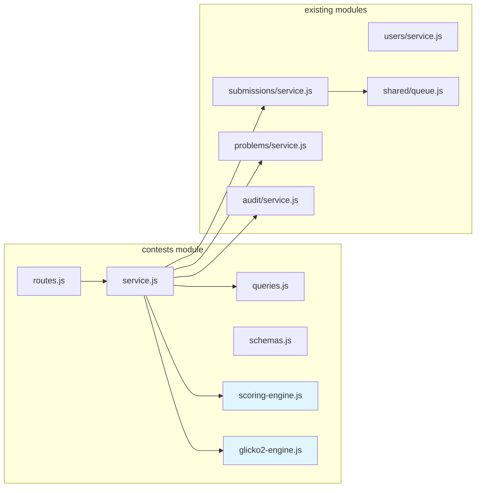
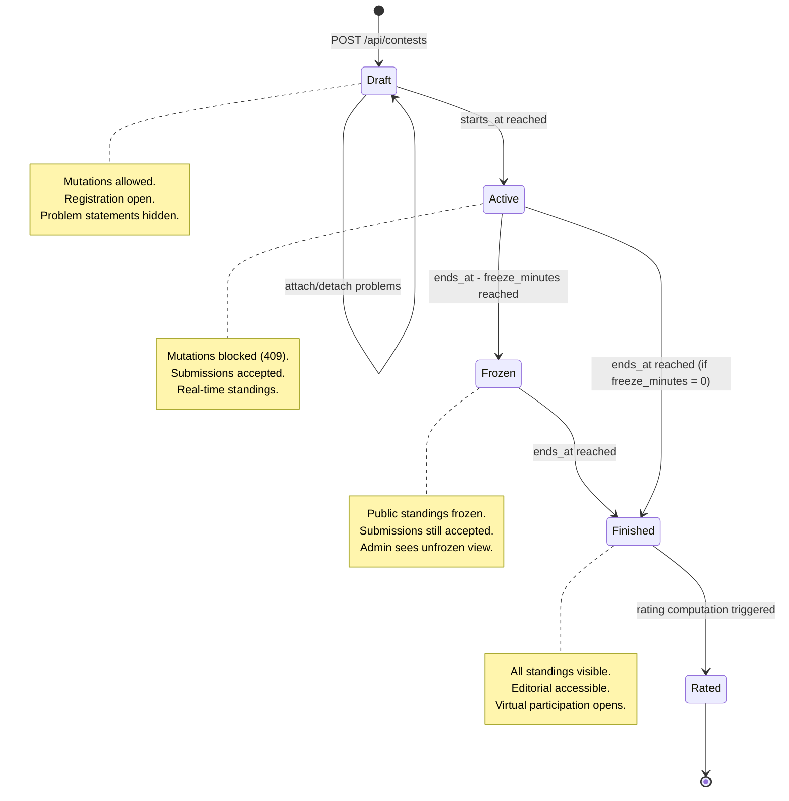
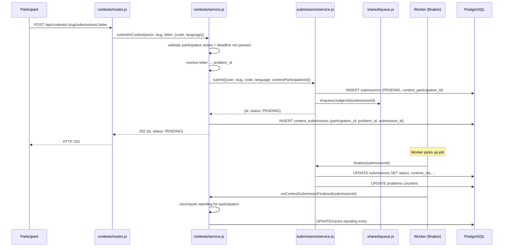

# Design Document: Contest Mode

## Overview

Contest Mode adds a first-class competitive-programming contest system to
SkillForge — university-wide events with ICPC-style scoring, real-time
leaderboards, frozen standings, virtual participation, Glicko-2 ratings, and
post-contest editorials. Contests are independent of courses: any authenticated
user can register and participate.

The feature is implemented as a new `src/modules/contests/` module following
ADR 0003 boundaries, with a forward-only migration `0009_contests.sql`, and
two pure-function engines (ICPC scoring + Glicko-2 rating) that are
independently testable via property-based tests.

**Key design decisions:**
- ICPC-style scoring only for v1 (solved DESC, penalty ASC).
- Individual contests only — no teams.
- Glicko-2 rating stored separately from `users.rating`.
- Frozen standings served from a time-based query filter, not a snapshot table.
- Contest submissions reuse the existing async judge pipeline (ADR 0013).
- Virtual participation uses the same scoring engine with a different
  `started_at` and `is_virtual = true`.

---

## Architecture

### Module Boundary Diagram



**Cross-module dependencies (per ADR 0003):**
- `contests/service.js` → `submissions/service.js` (submit contest solutions)
- `contests/service.js` → `problems/service.js` (resolve problem slugs)
- `contests/service.js` → `audit/service.js` (log privileged mutations)
- `contests/service.js` → `shared/queue.js` (enqueue via submissions service)

**No cross-module query imports.** The contests module owns its own tables and
queries; it calls other modules only through their service layer.

### Contest Lifecycle State Machine



The lifecycle is **time-driven** — there is no explicit state column. The
service computes the current phase from `NOW()` vs `starts_at`, `ends_at`, and
`freeze_minutes`.

### Contest Submission Flow



---

## Components and Interfaces

### File Structure

```
Backend/src/modules/contests/
├── routes.js          # Express router, auth middleware, schema validation
├── service.js         # Business logic, cross-module orchestration
├── queries.js         # SQL queries against contest_* tables
├── schemas.js         # Zod schemas for request validation
├── scoring-engine.js  # Pure function: computeICPCStandings()
└── glicko2-engine.js  # Pure function: computeGlicko2Changes()
```

### `scoring-engine.js` — Pure ICPC Scoring

```javascript
/**
 * computeICPCStandings(participations, submissions)
 *
 * @param participations - Array of { id, userId, username, startedAt, isVirtual }
 * @param submissions    - Array of { participationId, problemId, status, createdAt }
 * @returns Array of StandingEntry sorted by rank
 *
 * StandingEntry = {
 *   rank: number,
 *   participationId: number,
 *   userId: number,
 *   username: string,
 *   isVirtual: boolean,
 *   solvedCount: number,
 *   penaltyTime: number,
 *   problems: Map<problemId, {
 *     attempts: number,
 *     acceptedAt: Date | null,
 *     penaltyMinutes: number,
 *     isFirstSolve: boolean,
 *   }>
 * }
 */
```

**Algorithm:**
1. Group submissions by `(participationId, problemId)`.
2. For each group, find the first ACCEPTED submission (if any).
3. For solved problems: `penalty = floor((acceptedAt - startedAt) / 60000) + 20 * wrongBefore`.
4. For unsolved problems: penalty contribution = 0.
5. Aggregate per participant: `solvedCount`, `totalPenalty`.
6. Sort by `(solvedCount DESC, totalPenalty ASC)`.
7. Assign ranks with ties (same rank for equal `(solvedCount, totalPenalty)`).
8. Mark first-solves per problem (earliest `acceptedAt` across all participants).

### `glicko2-engine.js` — Pure Glicko-2 Rating

```javascript
/**
 * computeGlicko2Changes(participants, standings)
 *
 * @param participants - Array of { userId, rating, rd, volatility }
 * @param standings    - Array of { userId, rank } (live participants only)
 * @returns Array of { userId, oldRating, newRating, oldRd, newRd, delta }
 *
 * Invariant: sum(delta) ≈ 0 (within ±0.01 * N)
 */
```

**Algorithm:** Standard Glicko-2 (Mark Glickman, 2012):
1. Convert ratings to Glicko-2 scale (μ = (r - 1500) / 173.7178).
2. For each player, compute expected outcomes against all opponents based on
   rank comparison (win if rank < opponent rank, loss if rank > opponent rank,
   draw if tied).
3. Compute variance `v`, delta `Δ`, and new volatility `σ'` via the iterative
   algorithm (Illinois method for the volatility equation).
4. Update `φ' = 1 / sqrt(1/φ*² + 1/v)` and `μ' = μ + φ'² * Σ(g(φj) * (sj - E))`.
5. Convert back to rating scale.
6. **Normalize deltas to enforce zero-sum:** subtract `mean(delta)` from each
   participant's delta. This ensures the rating pool is conserved.

**Initial values:** rating = 1500, RD = 350, volatility = 0.06.

### `service.js` — Key Functions

| Function | Description |
|---|---|
| `createContest(actor, payload)` | Validate + insert + audit |
| `updateContest(actor, slug, fields)` | Assert not started + update + audit |
| `deleteContest(actor, slug)` | Admin-only + cascade + audit |
| `attachProblem(actor, slug, payload)` | Assert not started + resolve problem + insert |
| `detachProblem(actor, slug, letter)` | Assert not started + remove |
| `register(actor, slug)` | Assert before starts_at + insert registration |
| `unregister(actor, slug)` | Assert before starts_at + remove registration |
| `participate(actor, slug, { virtual })` | Create participation row with deadline |
| `submitInContest(actor, slug, letter, payload)` | Validate + delegate to submissions.submit |
| `getStandings(actor, slug, { unfrozen, since })` | Compute or return frozen standings |
| `finalizeContestRatings(slug)` | Compute Glicko-2 + insert rating changes |
| `getContestRating(username)` | Return current rating + history |

### `routes.js` — Endpoint Map

| Method | Path | Auth | Description |
|---|---|---|---|
| POST | `/api/contests` | INSTRUCTOR, ADMIN | Create contest |
| GET | `/api/contests` | requireAuth | List contests (paginated, filterable) |
| GET | `/api/contests/:slug` | requireAuth | Contest detail |
| PUT | `/api/contests/:slug` | INSTRUCTOR, ADMIN | Update contest |
| DELETE | `/api/contests/:slug` | ADMIN | Delete contest |
| POST | `/api/contests/:slug/problems` | INSTRUCTOR, ADMIN | Attach problem |
| DELETE | `/api/contests/:slug/problems/:letter` | INSTRUCTOR, ADMIN | Detach problem |
| POST | `/api/contests/:slug/register` | requireAuth | Register |
| DELETE | `/api/contests/:slug/register` | requireAuth | Unregister |
| POST | `/api/contests/:slug/participate` | requireAuth | Start participation |
| POST | `/api/contests/:slug/submissions/:letter` | requireAuth | Submit solution |
| GET | `/api/contests/:slug/standings` | requireAuth | Get standings |
| PUT | `/api/contests/:slug/editorial` | INSTRUCTOR, ADMIN | Publish editorial |
| GET | `/api/contests/:slug/editorial` | requireAuth | Get editorial |
| GET | `/api/users/:username/contests` | requireAuth | User contest history |
| GET | `/api/users/:username/contest-rating` | requireAuth | User rating |

### Frontend Pages

| Route | Component | Description |
|---|---|---|
| `/contests` | ContestList | Status tabs (upcoming/running/finished) |
| `/contests/:slug` | ContestDetail | Info + workspace + standings tabs |
| `/contests/:slug/standings` | ContestStandings | Real-time leaderboard |
| `/contests/:slug/problems/:letter` | ContestProblem | Problem view + editor |
| `/profile/:username/contests` | ContestHistory | History table + rating graph |

---

## Data Models

### Migration: `db/migrations/0009_contests.sql`

```sql
-- 0009_contests.sql
-- Contest mode: university-wide competitive-programming events with
-- ICPC scoring, frozen standings, virtual participation, and Glicko-2 rating.

CREATE TABLE IF NOT EXISTS contests (
  id              INTEGER GENERATED BY DEFAULT AS IDENTITY PRIMARY KEY,
  slug            TEXT NOT NULL UNIQUE,
  title           TEXT NOT NULL,
  description     TEXT,
  starts_at       TIMESTAMPTZ NOT NULL,
  ends_at         TIMESTAMPTZ NOT NULL,
  freeze_minutes  INTEGER NOT NULL DEFAULT 30,
  is_public       BOOLEAN NOT NULL DEFAULT true,
  editorial       TEXT,
  created_at      TIMESTAMPTZ NOT NULL DEFAULT NOW(),
  CHECK (ends_at > starts_at),
  CHECK (freeze_minutes >= 0)
);

CREATE TABLE IF NOT EXISTS contest_problems (
  contest_id  INTEGER NOT NULL REFERENCES contests(id) ON DELETE CASCADE,
  problem_id  INTEGER NOT NULL REFERENCES problems(id) ON DELETE RESTRICT,
  letter      TEXT NOT NULL,
  PRIMARY KEY (contest_id, problem_id),
  UNIQUE (contest_id, letter),
  CHECK (letter ~ '^[A-Z]$')
);
CREATE INDEX IF NOT EXISTS idx_contest_problems_problem ON contest_problems(problem_id);

CREATE TABLE IF NOT EXISTS contest_registrations (
  contest_id    INTEGER NOT NULL REFERENCES contests(id) ON DELETE CASCADE,
  user_id       INTEGER NOT NULL REFERENCES users(id) ON DELETE CASCADE,
  registered_at TIMESTAMPTZ NOT NULL DEFAULT NOW(),
  UNIQUE (contest_id, user_id)
);
CREATE INDEX IF NOT EXISTS idx_contest_registrations_user ON contest_registrations(user_id);

CREATE TABLE IF NOT EXISTS contest_participations (
  id                INTEGER GENERATED BY DEFAULT AS IDENTITY PRIMARY KEY,
  contest_id        INTEGER NOT NULL REFERENCES contests(id) ON DELETE CASCADE,
  user_id           INTEGER NOT NULL REFERENCES users(id) ON DELETE CASCADE,
  started_at        TIMESTAMPTZ NOT NULL DEFAULT NOW(),
  is_virtual        BOOLEAN NOT NULL DEFAULT false,
  personal_deadline TIMESTAMPTZ NOT NULL
);
-- Live participations are unique per (contest, user); virtual ones are not
-- (a user could do multiple virtual attempts). Enforced via partial unique index.
CREATE UNIQUE INDEX IF NOT EXISTS uniq_contest_live_participation
  ON contest_participations(contest_id, user_id) WHERE is_virtual = false;
CREATE INDEX IF NOT EXISTS idx_contest_participations_user ON contest_participations(user_id);
CREATE INDEX IF NOT EXISTS idx_contest_participations_contest ON contest_participations(contest_id);

CREATE TABLE IF NOT EXISTS contest_submissions (
  id                INTEGER GENERATED BY DEFAULT AS IDENTITY PRIMARY KEY,
  participation_id  INTEGER NOT NULL REFERENCES contest_participations(id) ON DELETE CASCADE,
  problem_id        INTEGER NOT NULL REFERENCES problems(id) ON DELETE CASCADE,
  submission_id     INTEGER NOT NULL REFERENCES submissions(id) ON DELETE CASCADE,
  created_at        TIMESTAMPTZ NOT NULL DEFAULT NOW()
);
CREATE INDEX IF NOT EXISTS idx_contest_submissions_participation ON contest_submissions(participation_id);
CREATE INDEX IF NOT EXISTS idx_contest_submissions_problem ON contest_submissions(problem_id);
CREATE INDEX IF NOT EXISTS idx_contest_submissions_submission ON contest_submissions(submission_id);

CREATE TABLE IF NOT EXISTS contest_ratings (
  user_id          INTEGER NOT NULL REFERENCES users(id) ON DELETE CASCADE UNIQUE,
  rating           REAL NOT NULL DEFAULT 1500,
  rating_deviation REAL NOT NULL DEFAULT 350,
  volatility       REAL NOT NULL DEFAULT 0.06,
  contests_played  INTEGER NOT NULL DEFAULT 0,
  last_contest_at  TIMESTAMPTZ
);

CREATE TABLE IF NOT EXISTS contest_rating_changes (
  id          INTEGER GENERATED BY DEFAULT AS IDENTITY PRIMARY KEY,
  contest_id  INTEGER NOT NULL REFERENCES contests(id) ON DELETE CASCADE,
  user_id     INTEGER NOT NULL REFERENCES users(id) ON DELETE CASCADE,
  old_rating  REAL NOT NULL,
  new_rating  REAL NOT NULL,
  old_rd      REAL NOT NULL,
  new_rd      REAL NOT NULL,
  rank        INTEGER NOT NULL,
  delta       REAL NOT NULL
);
CREATE INDEX IF NOT EXISTS idx_contest_rating_changes_user ON contest_rating_changes(user_id);
CREATE INDEX IF NOT EXISTS idx_contest_rating_changes_contest ON contest_rating_changes(contest_id);
```

### Entity Relationships

```
contests 1──* contest_problems *──1 problems
contests 1──* contest_registrations *──1 users
contests 1──* contest_participations *──1 users
contest_participations 1──* contest_submissions *──1 submissions
contest_submissions *──1 problems
contests 1──* contest_rating_changes *──1 users
users 1──0..1 contest_ratings
```

### Key Design Choices

1. **`personal_deadline` stored, not computed.** Unlike exams where the deadline
   is `min(started_at + duration, ends_at)` computed on read, contests store it
   at participation-creation time. This avoids recomputing on every standings
   query and makes the deadline immutable once set.

2. **Partial unique index for live participations.** A user can have at most one
   live participation per contest, but multiple virtual ones. The partial unique
   index `WHERE is_virtual = false` enforces this at the DB level.

3. **`contest_submissions` as a link table.** Rather than adding a nullable
   `contest_participation_id` to the existing `submissions` table (which would
   widen every row), we use a separate link table. This keeps the submissions
   table unchanged and allows contest-specific queries without scanning all
   submissions.

4. **`contest_ratings` separate from `users.rating`.** The existing
   `users.rating` is a simple first-solve counter for badges. Contest rating is
   a proper Glicko-2 value with deviation and volatility — fundamentally
   different semantics.

5. **No standings cache table.** Standings are computed on-the-fly from
   `contest_submissions` joined with `submissions` (for verdict). For contests
   with < 1000 participants this is fast enough. A materialized cache can be
   added later if needed.

6. **Frozen standings via time filter.** During the freeze period, the standings
   query filters submissions to `created_at < ends_at - freeze_minutes`. No
   snapshot is stored — the freeze is a query-time concern.

---

## Correctness Properties

*A property is a characteristic or behavior that should hold true across all
valid executions of a system — essentially, a formal statement about what the
system should do. Properties serve as the bridge between human-readable
specifications and machine-verifiable correctness guarantees.*

### Property 1: Ranking monotonicity

*For any* set of contest participants, if participant A solved strictly more
problems than participant B, then A's rank SHALL be strictly better (lower
number) than B's. If A and B solved the same number of problems and A has
strictly less penalty time, then A's rank SHALL be strictly better than B's.
If A and B have the same solved count and the same penalty time, they SHALL
have the same rank.

**Validates: Requirements 7.1, 7.4**

### Property 2: Penalty time correctness

*For any* participant and *for any* solved problem in their submission history,
the penalty time for that problem SHALL equal
`floor((accepted_submission_time - started_at) / 60000) + 20 * rejected_attempts_before_accept`.
*For any* unsolved problem (attempted but never accepted), the penalty
contribution SHALL be zero.

**Validates: Requirements 7.2, 7.3**

### Property 3: Frozen standings consistency

*For any* contest with `freeze_minutes > 0`, the public standings returned
during the freeze period (between `ends_at - freeze_minutes` and `ends_at`)
SHALL be identical to the standings computed from only those submissions
finalized before `ends_at - freeze_minutes`. No submission finalized after the
freeze point SHALL alter the public standings response until after `ends_at`.

**Validates: Requirements 9.1, 9.3**

### Property 4: Virtual parity

*For any* virtual participant V and *for any* hypothetical live participant L
with identical submission sequences (same problems, same verdicts, same relative
timestamps from their respective `started_at`), V's computed score (solved
count and penalty time) SHALL equal L's computed score.

**Validates: Requirements 5.4, 7.2**

### Property 5: Idempotent standing recomputation

*For any* contest, recomputing standings from scratch using all finalized
submissions SHALL produce the same ranking (same ranks, same penalty times,
same solved counts) as the incrementally-maintained standings.

**Validates: Requirements 7.5**

### Property 6: Rating conservation (zero-sum)

*For any* contest with N ≥ 2 live participants, the sum of all `delta` values
produced by the Glicko-2 engine SHALL equal zero within a floating-point
tolerance of ±0.01 per participant (i.e., `|sum(deltas)| ≤ 0.01 * N`).

**Validates: Requirements 10.6**

---

## Error Handling

| Scenario | HTTP | Error Code | Behavior |
|---|---|---|---|
| Create/update with `ends_at <= starts_at` | 400 | `VALIDATION_ERROR` | Zod rejects at schema layer |
| PUT/attach/detach after `starts_at` | 409 | `CONTEST_ALREADY_STARTED` | Service checks `NOW() >= starts_at` |
| Register after `starts_at` (contest not finished) | 400 | `REGISTRATION_CLOSED` | Service checks time window |
| Already registered | 409 | `ALREADY_REGISTERED` | UNIQUE violation mapped |
| Participate without registration (live) | 403 | `NOT_REGISTERED` | Service checks registration row |
| Already participating (live) | 409 | `ALREADY_PARTICIPATING` | Partial UNIQUE index violation |
| Participate outside time window | 400 | `CONTEST_NOT_ACTIVE` | Service checks `starts_at <= NOW() < ends_at` |
| Submit after personal deadline | 400 | `CONTEST_TIME_EXPIRED` | Service checks `NOW() < personal_deadline` |
| Submit with invalid letter | 404 | — | Letter not in `contest_problems` |
| Submit with disallowed language | 400 | `LANGUAGE_NOT_ALLOWED` | Delegated to submissions service |
| Judge error during finalization | — | `JUDGE_ERROR` | Standing not altered; submission marked failed |
| Delete contest (non-ADMIN) | 403 | — | Route-level `requireRole(ADMIN)` |
| Unfrozen standings (non-ADMIN) | 403 | — | Service checks `actor.role === ADMIN` |
| Editorial before contest ends | 404 | — | Service returns 404 if `NOW() < ends_at` |

**Transaction boundaries:**
- Contest creation, update, delete: wrapped in `withTransaction`.
- Contest submission: the `contest_submissions` insert is in the same
  transaction as the `submissions` PENDING insert.
- Rating computation: all `contest_rating_changes` inserts + `contest_ratings`
  updates in a single transaction (all-or-nothing).

**Idempotency:** Contest submissions inherit the `Idempotency-Key` behavior
from the submissions service (ADR 0013). A retried contest submit with the same
key returns the existing submission without creating a duplicate.

---

## Testing Strategy

### Property-Based Tests (PBT)

The scoring engine and Glicko-2 engine are pure functions with clear
input/output behavior and large input spaces — ideal for PBT.

**Library:** [fast-check](https://github.com/dubzzz/fast-check) (already
available in the Node ecosystem, pairs well with the existing test runner).

**Configuration:** Minimum 100 iterations per property test.

**Tag format:** `Feature: contest-mode, Property N: <property_text>`

| Property | Target Function | Generator Strategy |
|---|---|---|
| 1: Ranking monotonicity | `computeICPCStandings` | Random participant arrays with random solved/penalty values |
| 2: Penalty time correctness | `computeICPCStandings` | Random submission sequences with varying timestamps and verdicts |
| 3: Frozen standings consistency | `computeICPCStandings` + time filter | Random submissions split before/after freeze point |
| 4: Virtual parity | `computeICPCStandings` | Paired virtual/live participants with identical relative sequences |
| 5: Idempotent recomputation | `computeICPCStandings` | Random submission sequences, compare batch vs incremental |
| 6: Rating conservation | `computeGlicko2Changes` | Random participant ratings + random standings |

### Unit Tests (Example-Based)

- Scoring engine: specific examples (0 solved, all solved, ties, single
  participant).
- Glicko-2 engine: known reference computations from the Glicko-2 paper.
- Frozen standings: edge cases (freeze_minutes = 0, submission exactly at
  freeze boundary).
- Personal deadline: edge cases (late joiner where `started_at + duration >
  ends_at`).

### Integration Tests (Supertest)

Full contest lifecycle driven through HTTP:
1. Create contest → attach problems → register → participate → submit →
   verify standings → end contest → verify unfrozen → compute ratings.
2. Virtual participation flow: join after ends_at → submit → verify separate
   standings section → verify no rating change.
3. Authorization matrix: STUDENT cannot create/update/delete; unauth gets 401;
   ADMIN can see unfrozen standings.
4. Temporal guards: cannot update after start, cannot register after start,
   cannot submit after deadline.
5. Feed filtering: contest submissions excluded from `/api/submissions/recent`.

### Frontend Tests

- Component tests for standings table rendering (frozen indicator, first-solve
  highlight, virtual badge).
- Rating graph rendering with mock data.
- Countdown timer behavior at deadline expiry.

