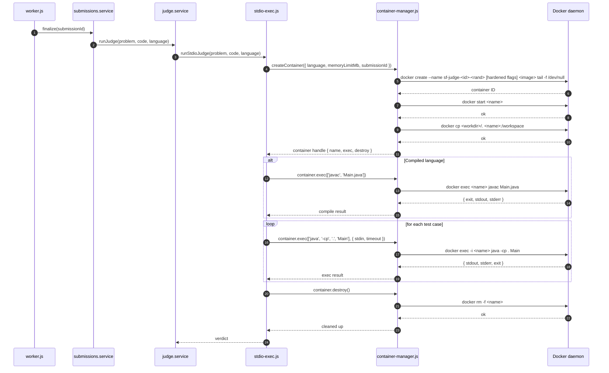
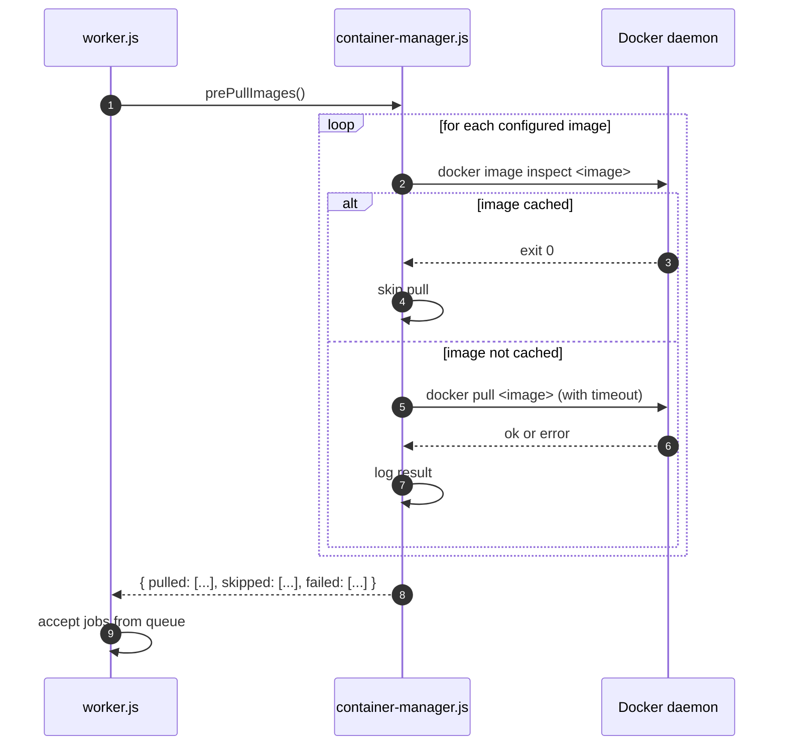
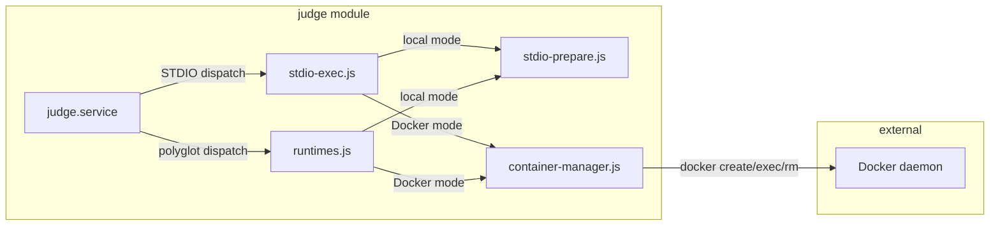

# Design Document

## Overview

SkillForge's STDIO judge (ADR 0015) and polyglot function judge (ADR 0014)
already support a `JUDGE_RUNTIME_MODE=docker` path that spawns ephemeral
Docker containers. The current implementation creates a **new container per
test case** (via `docker run --rm`) with basic isolation flags
(`--network=none`, `--read-only`, `--memory`). This works for development
but has two production-grade gaps:

1. **Performance**: container startup overhead (~200–500 ms) is paid per test
   case, making a 20-test-case submission 4–10 seconds slower than necessary.
2. **Security**: missing PID limits, file-descriptor limits,
   `no-new-privileges`, CPU caps, and per-submission timeout enforcement.

This design introduces a **Container_Lifecycle_Manager** that consolidates
the Docker lifecycle to **one container per submission** using
`docker create` → `docker start` → `docker exec` (compile + each test case)
→ `docker rm -f`. It adds hardened security flags, per-submission timeout
enforcement, image pre-pull on worker startup, and graceful degradation.

### Key design decisions and rationale

1. **`docker create` + `docker exec` pattern over `docker run` per test.**
   Creating the container once and exec-ing into it for each test case
   eliminates repeated container startup overhead. The container stays alive
   for the submission's lifetime, and we pipe stdin/capture stdout per exec.
   This is the pattern used by competitive-programming judges like
   [DMOJ](https://github.com/DMOJ/judge-server) and
   [Kattis](https://www.kattis.com/).

2. **Single new file: `container-manager.js`.** All Docker lifecycle logic
   lives in one module-internal file. Both `stdio-exec.js` and `runtimes.js`
   delegate to it when in Docker mode, keeping the container management
   concern in one place (DRY) while preserving the existing local-mode code
   paths untouched.

3. **Per-submission timeout as a container-level kill.** Rather than relying
   solely on per-test timeouts (which a malicious program could circumvent by
   being slow across many tests), we compute an aggregate ceiling and
   `docker kill` the entire container if exceeded. This is defense-in-depth.

4. **Image pre-pull is best-effort with a 120 s ceiling.** The worker should
   not block indefinitely on a slow registry. Missing images are logged as
   warnings; the first submission for that language will pay the pull penalty
   or get `JUDGE_ERROR` if the pull fails at submission time.

5. **Environment variable overrides for all limits.** On-prem operators may
   need to tune PID limits (e.g., Java needs more threads), CPU caps, or
   tmpfs size. Every hardened flag has a corresponding env var with a sensible
   default.

6. **Local mode is completely untouched.** The container manager is never
   imported or invoked when `JUDGE_RUNTIME_MODE=local` or `off`. All existing
   tests pass unchanged. This makes the upgrade strictly additive.

### Research notes

- **`docker exec` stdin piping**: `docker exec -i` reads stdin from the
  attached stream, which is exactly what we need for per-test-case input.
  The `child_process.execFile('docker', ['exec', '-i', name, ...cmd])`
  pattern lets us write stdin and capture stdout/stderr per test case
  without restarting the container.
- **Container naming**: Using `sf-judge-<submissionId>-<random>` provides
  traceability (submission ID for debugging) plus non-predictability (random
  suffix prevents name-guessing attacks between concurrent submissions).
- **PID limit of 64**: Java's JVM spawns ~20 threads at startup; Go's
  runtime spawns ~4. A limit of 64 gives comfortable headroom for legitimate
  programs while stopping fork bombs. Configurable via
  `JUDGE_DOCKER_PIDS_LIMIT` for operators who need more (e.g., Java with
  heavy concurrency).
- **`--ulimit nofile=64:64`**: Most competitive-programming solutions open
  at most stdin/stdout/stderr (3 FDs). 64 is generous for legitimate use
  while preventing FD exhaustion attacks.
- **Per-submission timeout formula**: `time_limit_ms × test_count × 1.5 +
  compile_overhead_ms` accounts for per-test execution time, a 50% buffer
  for container overhead, and compilation. Clamped to [10 s, 300 s] to
  prevent both too-aggressive kills and indefinite hangs.

## Architecture

The Container_Lifecycle_Manager sits between the judge execution layers
(`stdio-exec.js`, `runtimes.js`) and the Docker daemon. It owns the full
container lifecycle and exposes a simple interface for creating, executing
commands in, and destroying containers.

### Container lifecycle flow (Submit)



### Worker startup flow (Image pre-pull)



### Module-boundary diagram



### New / changed files

| File | Purpose | New or changed |
|---|---|---|
| `Backend/src/modules/judge/container-manager.js` | Container lifecycle: create, exec, destroy, pre-pull | **new** |
| `Backend/src/modules/judge/stdio-exec.js` | Delegate to container-manager in Docker mode | changed |
| `Backend/src/modules/judge/runtimes.js` | Delegate to container-manager in Docker mode | changed |
| `Backend/src/modules/judge/stdio-prepare.js` | Simplified: no longer builds Docker run steps directly | changed |
| `Backend/src/worker.js` | Add image pre-pull before accepting jobs | changed |
| `Backend/test/container-manager.test.mjs` | Unit tests for container-manager (mocked Docker) | **new** |
| `Backend/test/container-manager-integration.test.mjs` | Integration tests (real Docker, guarded) | **new** |
| `Backend/test/container-manager-properties.test.mjs` | Property-based tests for container-manager | **new** |

## Components and Interfaces

### Container_Lifecycle_Manager (`container-manager.js`)

```js
// modules/judge/container-manager.js — public interface

/**
 * Configuration read from environment variables with defaults.
 */
export const CONTAINER_DEFAULTS = {
  pidsLimit: parseInt(process.env.JUDGE_DOCKER_PIDS_LIMIT || '64', 10),
  cpuLimit: parseFloat(process.env.JUDGE_DOCKER_CPU_LIMIT || '1'),
  nofileLimit: parseInt(process.env.JUDGE_DOCKER_NOFILE_LIMIT || '64', 10),
  tmpfsSizeMb: parseInt(process.env.JUDGE_DOCKER_TMPFS_SIZE_MB || '128', 10),
  compileOverheadMs: parseInt(process.env.JUDGE_DOCKER_COMPILE_OVERHEAD_MS || '30000', 10),
  seccompProfile: process.env.JUDGE_SECCOMP_PROFILE || null,
};

/**
 * Create a submission container with all hardened flags applied.
 *
 * @param {object} opts
 * @param {string} opts.image - Docker image to use
 * @param {string} opts.workdir - Host-side temp directory with source code
 * @param {number} opts.memoryLimitMb - Per-problem memory limit
 * @param {string} opts.submissionId - For naming and logging
 * @param {number} opts.timeoutMs - Per-submission timeout ceiling
 * @returns {Promise<ContainerHandle>}
 * @throws {ContainerStartError} if container fails to start
 */
export async function createContainer(opts) { /* ... */ }

/**
 * Execute a command inside a running container.
 *
 * @param {ContainerHandle} handle - From createContainer
 * @param {string[]} cmd - Command + args to exec
 * @param {object} [execOpts]
 * @param {string} [execOpts.stdin] - Data to pipe to stdin
 * @param {number} [execOpts.timeoutMs] - Per-exec wall-clock timeout
 * @param {number} [execOpts.outputCapBytes] - Max stdout bytes to capture
 * @returns {Promise<ExecResult>}
 */
export async function execInContainer(handle, cmd, execOpts) { /* ... */ }

/**
 * Forcibly destroy a container and clean up the host-side temp directory.
 * Idempotent: safe to call multiple times or after the container has
 * already been removed.
 *
 * @param {ContainerHandle} handle
 * @returns {Promise<void>}
 */
export async function destroyContainer(handle) { /* ... */ }

/**
 * Pre-pull all configured Docker images. Called by worker.js on startup.
 * Best-effort: logs warnings for failures, respects 120 s total ceiling.
 *
 * @returns {Promise<{ pulled: string[], skipped: string[], failed: string[] }>}
 */
export async function prePullImages() { /* ... */ }

/**
 * Compute the per-submission timeout.
 * Formula: time_limit_ms * test_count * 1.5 + compile_overhead_ms
 * Clamped to [10000, 300000] ms.
 *
 * @param {number} timeLimitMs - Per-test time limit
 * @param {number} testCount - Number of test cases
 * @param {boolean} isCompiled - Whether the language requires compilation
 * @returns {number} timeout in milliseconds
 */
export function computeSubmissionTimeout(timeLimitMs, testCount, isCompiled) { /* ... */ }
```

### ContainerHandle type

```ts
type ContainerHandle = {
  name: string;              // e.g. "sf-judge-42-a7f3bc"
  image: string;             // e.g. "python:3.12-alpine"
  workdir: string;           // host-side temp dir
  submissionId: string;      // for logging
  createdAt: number;         // Date.now() at creation
  timeoutMs: number;         // per-submission ceiling
  timeoutTimer: NodeJS.Timeout | null;  // kill timer
};
```

### ExecResult type

```ts
type ExecResult = {
  stdout: string;
  stderr: string;
  exit: number | null;
  signal: string | null;
  timeMs: number;
  killedReason: 'TLE' | 'OLE' | null;
  oomKilled: boolean;        // detected via docker inspect
};
```

### Docker command construction

The `createContainer` function builds the following `docker create` command:

```bash
docker create \
  --name sf-judge-<submissionId>-<randomSuffix> \
  --network=none \
  --read-only \
  --tmpfs=/tmp:rw,noexec,nosuid,size=<tmpfsSizeMb>m \
  --pids-limit=<pidsLimit> \
  --cpus=<cpuLimit> \
  --memory=<memoryLimitMb>m \
  --ulimit nofile=<nofileLimit>:<nofileLimit> \
  --security-opt=no-new-privileges \
  [--security-opt seccomp=<path>]  # only if JUDGE_SECCOMP_PROFILE is set
  -w /workspace \
  <image> \
  tail -f /dev/null
```

After `docker create`, the manager runs:
1. `docker start <name>` — starts the container with the idle entrypoint
2. `docker cp <workdir>/. <name>:/workspace` — copies source code in

The idle entrypoint (`tail -f /dev/null`) keeps the container alive so we
can `docker exec` into it multiple times. The container is destroyed with
`docker rm -f` which handles both running and stopped states.

### Integration with stdio-exec.js

```js
// modules/judge/stdio-exec.js — Docker mode changes (sketch)

import { createContainer, execInContainer, destroyContainer, computeSubmissionTimeout }
  from './container-manager.js';

export async function runStdioJudge(problem, code, language) {
  const mode = getStdioRuntimeMode();

  if (mode === 'local') {
    // Existing local-mode path — completely unchanged
    return runStdioJudgeLocal(problem, code, language);
  }

  // Docker mode: use container-manager
  const workdir = mkdtempSync(join(tmpdir(), 'stdio-judge-'));
  const prepared = prepareSource(language, code, workdir);  // write source only, no compile
  const image = getImageForLanguage(language);
  const timeout = computeSubmissionTimeout(
    problem.time_limit_ms,
    problem.test_cases_json.length,
    isCompiledLanguage(language),
  );

  let handle;
  try {
    handle = await createContainer({
      image,
      workdir,
      memoryLimitMb: problem.memory_limit_mb,
      submissionId: String(problem.id || 'run'),
      timeoutMs: timeout,
    });

    // Compile step (if needed)
    if (prepared.compileCmd) {
      const compileResult = await execInContainer(handle, prepared.compileCmd, {
        timeoutMs: CONTAINER_DEFAULTS.compileOverheadMs,
      });
      if (compileResult.exit !== 0) {
        return compileErrorVerdict(compileResult);
      }
    }

    // Run test cases
    const perTestResults = [];
    for (const tc of problem.test_cases_json) {
      const exec = await execInContainer(handle, prepared.runCmd, {
        stdin: tc.stdin,
        timeoutMs: problem.time_limit_ms * 1.5,
        outputCapBytes: problem.output_size_cap_kb * 1024,
      });
      const perTest = classify({ exec, tc, comparatorMode: problem.comparator_mode, ... });
      perTestResults.push(perTest);
      if (perTest.verdict !== 'ACCEPTED') break;
    }

    return aggregate(perTestResults, problem);
  } catch (err) {
    if (err.code === 'SUBMISSION_TIMEOUT') {
      return submissionTimeoutVerdict(problem);
    }
    return judgeErrorVerdict(err);
  } finally {
    if (handle) await destroyContainer(handle);
  }
}
```

### Integration with runtimes.js (polyglot function judge)

```js
// modules/judge/runtimes.js — Docker mode changes (sketch)

import { createContainer, execInContainer, destroyContainer, computeSubmissionTimeout }
  from './container-manager.js';

function runExternalJudge(language, problem, code) {
  const runtime = resolveRuntime(language);
  if (!runtime) return compileError({ ... });

  if (runtime.kind === 'docker') {
    return runExternalJudgeDocker(language, problem, code);
  }
  // Local path unchanged
  return runExternalJudgeLocal(language, problem, code);
}

async function runExternalJudgeDocker(language, problem, code) {
  const dir = mkdtempSync(...);
  const prepared = prepareRuntime(language, dir, problem, code, tests);
  const image = DOCKER_IMAGES[language]();
  const timeout = computeSubmissionTimeout(
    problem.time_limit_ms || DEFAULT_TIME_LIMIT_MS,
    tests.length,
    !!prepared.compile,
  );

  let handle;
  try {
    handle = await createContainer({
      image, workdir: dir,
      memoryLimitMb: DOCKER_MEMORY_MB,
      submissionId: String(problem.id || 'polyglot'),
      timeoutMs: timeout,
    });

    if (prepared.compile) {
      const compile = await execInContainer(handle, prepared.compile.dockerArgs, {
        timeoutMs: COMPILE_TIMEOUT_MS,
      });
      if (compile.exit !== 0) return compileError({ ... });
    }

    const run = await execInContainer(handle, prepared.run.dockerArgs, {
      timeoutMs: problem.time_limit_ms || DEFAULT_TIME_LIMIT_MS,
    });
    // Parse JSON-lines output, same as existing logic
    return finishExternalVerdict({ ... });
  } catch (err) {
    if (err.code === 'SUBMISSION_TIMEOUT') return tle({ ... });
    return runtimeError({ ... });
  } finally {
    if (handle) await destroyContainer(handle);
    rmSync(dir, { recursive: true, force: true });
  }
}
```

### Worker startup changes

```js
// src/worker.js — additions

import { prePullImages } from './modules/judge/container-manager.js';
import { getStdioRuntimeMode } from './modules/judge/stdio-prepare.js';

async function main() {
  await runMigrations();

  // Pre-pull Docker images if Docker mode is active
  const runtimeMode = getStdioRuntimeMode();
  if (runtimeMode === 'docker') {
    logger.info('Pre-pulling Docker images for judge...');
    const result = await prePullImages();
    logger.info(
      { pulled: result.pulled.length, skipped: result.skipped.length, failed: result.failed.length },
      'Docker image pre-pull complete',
    );
  }

  const worker = await startBullmqWorker({ concurrency });
  // ... rest unchanged
}
```

## Data Models

This feature introduces no database schema changes. The container lifecycle
is entirely ephemeral — containers are created and destroyed within a single
`finalize()` call. All configuration is via environment variables.

### Environment variable configuration

| Variable | Default | Description |
|---|---|---|
| `JUDGE_RUNTIME_MODE` | `auto` | `auto` / `local` / `docker` / `off` — existing, unchanged |
| `JUDGE_DOCKER_PIDS_LIMIT` | `64` | Max processes inside the container |
| `JUDGE_DOCKER_CPU_LIMIT` | `1` | CPU cores allocated to the container |
| `JUDGE_DOCKER_NOFILE_LIMIT` | `64` | Max open file descriptors |
| `JUDGE_DOCKER_TMPFS_SIZE_MB` | `128` | Writable tmpfs size in MB |
| `JUDGE_DOCKER_COMPILE_OVERHEAD_MS` | `30000` | Compile time budget added to per-submission timeout |
| `JUDGE_SECCOMP_PROFILE` | _(unset)_ | Path to custom seccomp JSON profile |
| `JUDGE_NODE_IMAGE` | `node:20-alpine` | Docker image for JavaScript |
| `JUDGE_PYTHON_IMAGE` | `python:3.12-alpine` | Docker image for Python |
| `JUDGE_JAVA_IMAGE` | `eclipse-temurin:21-jdk-alpine` | Docker image for Java |
| `JUDGE_GO_IMAGE` | `golang:1.23-alpine` | Docker image for Go |
| `JUDGE_CPP_IMAGE` | `gcc:13-bookworm` | Docker image for C++ |

### Docker image set

The configured image set is the union of images from both judge types:

```js
const CONFIGURED_IMAGES = {
  JAVASCRIPT: () => process.env.JUDGE_NODE_IMAGE || 'node:20-alpine',
  PYTHON: () => process.env.JUDGE_PYTHON_IMAGE || 'python:3.12-alpine',
  JAVA: () => process.env.JUDGE_JAVA_IMAGE || 'eclipse-temurin:21-jdk-alpine',
  GO: () => process.env.JUDGE_GO_IMAGE || 'golang:1.23-alpine',
  CPP: () => process.env.JUDGE_CPP_IMAGE || 'gcc:13-bookworm',
};
```

### Container naming scheme

```
sf-judge-<submissionId>-<6-char-hex-random>
```

Examples:
- `sf-judge-1042-a7f3bc`
- `sf-judge-run-e91d04` (for Run flow)

The submission ID provides traceability; the random suffix prevents
name collisions between concurrent submissions and makes names
non-predictable.

### Per-submission timeout computation

```
timeout = clamp(
  time_limit_ms × test_count × 1.5 + compile_overhead_ms,
  10000,   // floor: 10 seconds
  300000   // ceiling: 5 minutes
)

where compile_overhead_ms =
  JUDGE_DOCKER_COMPILE_OVERHEAD_MS  if language ∈ { JAVA, GO, CPP }
  0                                  if language ∈ { JAVASCRIPT, PYTHON }
```


## Correctness Properties

*A property is a characteristic or behavior that should hold true across all
valid executions of a system — essentially, a formal statement about what
the system should do. Properties serve as the bridge between human-readable
specifications and machine-verifiable correctness guarantees.*

The Container_Lifecycle_Manager is dominated by deterministic command
construction (pure functions that build Docker arg arrays), state-machine
transitions (create → exec → destroy), and invariant enforcement (all
flags always present, cleanup always happens). These are excellent
candidates for property-based testing. Integration-level properties
(actual Docker execution, fork-bomb containment, network isolation) are
tested with example-based integration tests guarded behind a `docker info`
probe.

### Property 1: All hardened security flags are present in every container

*For any* submission (any language, any problem configuration, any memory
limit), the Docker `create` command arguments produced by the
Container_Lifecycle_Manager SHALL contain ALL of the following flags:
`--network=none`, `--read-only`,
`--tmpfs=/tmp:rw,noexec,nosuid,size=<configured>m`, `--pids-limit=<configured>`,
`--cpus=<configured>`, `--memory=<memoryLimitMb>m`,
`--ulimit nofile=<configured>:<configured>`, and
`--security-opt=no-new-privileges`.

**Validates: Requirements 2.1, 2.2, 2.3, 2.4, 2.5, 2.6, 2.7, 2.8**

### Property 2: Exactly one container is created per submission

*For any* submission processed in Docker mode (regardless of judge type,
language, or number of test cases), the Container_Lifecycle_Manager SHALL
issue exactly one `docker create` command and exactly one `docker start`
command for the entire submission lifecycle.

**Validates: Requirements 1.1, 1.2**

### Property 3: Container cleanup is guaranteed after every submission outcome

*For any* submission outcome (ACCEPTED, WRONG_ANSWER, TLE, MLE, RE, OLE,
COMPILE_ERROR, JUDGE_ERROR, or per-submission timeout), the
Container_Lifecycle_Manager SHALL call `docker rm -f` on the container and
remove the host-side temporary directory. No container or temp directory
shall remain after the submission completes.

**Validates: Requirements 1.3, 8.5**

### Property 4: Per-submission timeout is correctly computed and clamped

*For any* combination of `timeLimitMs ∈ [100, 10000]`, `testCount ∈ [1, 100]`,
and `isCompiled ∈ { true, false }`, the computed per-submission timeout SHALL
equal `clamp(timeLimitMs × testCount × 1.5 + compileOverhead, 10000, 300000)`
where `compileOverhead` is `JUDGE_DOCKER_COMPILE_OVERHEAD_MS` for compiled
languages and 0 for interpreted languages.

**Validates: Requirements 3.1, 3.5**

### Property 5: Environment variable overrides are reflected in Docker args

*For any* set of configured environment variable overrides
(`JUDGE_DOCKER_PIDS_LIMIT`, `JUDGE_DOCKER_CPU_LIMIT`,
`JUDGE_DOCKER_NOFILE_LIMIT`, `JUDGE_DOCKER_TMPFS_SIZE_MB`), the Docker
`create` command arguments SHALL use the overridden values instead of the
defaults.

**Validates: Requirements 10.1, 10.2, 10.3, 10.4**

### Property 6: Container names are unique and non-predictable

*For any* two submissions processed by the Container_Lifecycle_Manager
(whether concurrent or sequential), the generated container names SHALL
be distinct. Each name SHALL contain a random component that is not
derivable from the submission ID alone.

**Validates: Requirements 8.1, 8.2**

### Property 7: Source code is mounted read-only

*For any* submission in Docker mode, the Docker `create` or `cp` command
arguments SHALL ensure the student source code is accessible inside the
container at `/workspace` and the container's root filesystem is read-only
(via `--read-only` flag).

**Validates: Requirements 1.4, 11.4**

### Property 8: Container environment is minimal

*For any* submission in Docker mode, the Docker `exec` command SHALL NOT
pass environment variables beyond `PATH` and language-specific compilation
variables (e.g., `GOCACHE`). No host environment variables (e.g.,
`DATABASE_URL`, `JWT_SECRET`) SHALL leak into the container.

**Validates: Requirements 11.3, 11.4**

### Property 9: Compile overhead is included in timeout only for compiled languages

*For any* submission in an interpreted language (JAVASCRIPT, PYTHON), the
per-submission timeout computation SHALL use `compileOverhead = 0`. *For any*
submission in a compiled language (JAVA, GO, CPP), the per-submission timeout
computation SHALL use `compileOverhead = JUDGE_DOCKER_COMPILE_OVERHEAD_MS`.

**Validates: Requirements 3.1, 10.5**

### Property 10: Seccomp profile is conditionally applied

*For any* submission, IF `JUDGE_SECCOMP_PROFILE` is set to a non-empty path,
THEN the Docker `create` args SHALL include `--security-opt seccomp=<path>`.
IF `JUDGE_SECCOMP_PROFILE` is unset or empty, THEN no `seccomp=` flag SHALL
appear in the Docker args.

**Validates: Requirements 2.9, 2.10, 10.6**

### Property 11: Log output never contains student code or I/O data

*For any* submission (any code content, any stdin, any stdout), the log
messages emitted by the Container_Lifecycle_Manager SHALL NOT contain the
student source code, stdin content, or stdout content. Log messages SHALL
contain only metadata: container name, image, submission ID, resource
limits, exit reason, and timing.

**Validates: Requirement 12.5**

### Property 12: Local mode never invokes Docker

*For any* submission processed when `JUDGE_RUNTIME_MODE=local`, the code
path SHALL NOT import, invoke, or reference the Container_Lifecycle_Manager,
and SHALL NOT spawn any process with `docker` as the command.

**Validates: Requirements 7.1, 7.2, 7.4**

## Error Handling

### Container creation failures

| Condition | Behaviour | Verdict |
|---|---|---|
| Image not found locally | `docker create` fails with exit 125 | `JUDGE_ERROR` with diagnostic "Image <name> not found" |
| Docker daemon unreachable | `docker create` fails or times out | `JUDGE_ERROR` with diagnostic "Docker daemon is unavailable" |
| Resource exhaustion (no memory for container) | `docker create` fails | `JUDGE_ERROR` with diagnostic from Docker stderr |
| Container name collision (extremely unlikely) | `docker create` fails | Retry once with new random suffix; if still fails, `JUDGE_ERROR` |

### Per-submission timeout

| Condition | Behaviour | Verdict |
|---|---|---|
| Container exceeds computed timeout | `docker kill <name>` issued | Overall `TIME_LIMIT_EXCEEDED` with diagnostic "Submission exceeded aggregate time budget (Xs computed from N tests × T ms + compile overhead)" |
| `docker kill` itself fails | `docker rm -f` as fallback | Same verdict; warn-level log |

### Per-exec failures

| Condition | Behaviour | Verdict |
|---|---|---|
| `docker exec` returns non-zero exit | Captured as `exec.exit` | Classified by `classify()` — typically `RE` |
| OOM kill inside container | `docker exec` returns 137 + `docker inspect` confirms OOMKilled | Per-test `MLE` |
| Exec timeout (per-test TLE) | `docker exec` killed after `1.5 × timeLimitMs` | Per-test `TLE` |
| Output cap exceeded | Stop reading stdout, kill exec | Per-test `OLE` |
| Container dies mid-exec (unexpected) | `docker exec` returns error | Per-test `JUDGE_ERROR` |

### Graceful degradation

| `JUDGE_RUNTIME_MODE` | Docker available | Behaviour |
|---|---|---|
| `auto` | yes | Use Docker (container-manager) |
| `auto` | no | Fall back to local subprocess |
| `docker` | yes | Use Docker (container-manager) |
| `docker` | no | `JUDGE_ERROR`: "Docker is required but unavailable" |
| `local` | — | Local subprocess, no Docker commands |
| `off` | — | `JUDGE_ERROR`: "Judging is disabled" |

### Worker resilience

- If Docker becomes unreachable mid-flight (after worker startup), the
  affected submission gets `JUDGE_ERROR`. The worker process does NOT crash.
- The `destroyContainer` function is idempotent: calling it on an
  already-removed container is a no-op (catches the "no such container"
  error from `docker rm -f`).
- The per-submission timeout timer is always cleared in the `finally` block,
  preventing timer leaks.

## Testing Strategy

PBT is applicable to the pure-function layers of the container manager
(command construction, timeout computation, name generation, flag assembly)
and explicitly NOT applicable to the actual Docker daemon interaction.

### Property-based tests (fast-check)

Library: **[fast-check](https://fast-check.dev/)** — already used by the
STDIO judge spec.

Each property test MUST:
- Run ≥ 100 iterations;
- Carry a header comment tagged
  `// Feature: docker-isolation, Property {number}: {property_text}`;
- Use mocks for `child_process.execFile` to avoid actual Docker calls
  during PBT iterations.

| File | Properties | Uses mocks? |
|---|---|---|
| `test/container-manager-properties.test.mjs` | P1, P2, P3, P4, P5, P6, P7, P8, P9, P10, P11, P12 | yes (mock `child_process.execFile`) |

Generators:
- `arbLanguage`: one of `['JAVASCRIPT', 'PYTHON', 'JAVA', 'GO', 'CPP']`
- `arbMemoryLimit`: integer in `[16, 512]`
- `arbTimeLimitMs`: integer in `[100, 10000]`
- `arbTestCount`: integer in `[1, 100]`
- `arbSubmissionId`: string of `[a-z0-9]{1,20}`
- `arbCode`: arbitrary string (for verifying it doesn't appear in logs)
- `arbEnvOverrides`: record of optional numeric overrides for each env var

### Unit tests (example-based)

| File | Coverage |
|---|---|
| `test/container-manager.test.mjs` | Container start failure → JUDGE_ERROR (1.5); seccomp conditional (2.9, 2.10); graceful degradation modes (5.1–5.5); delegation from stdio-exec (6.2); delegation from runtimes (6.3); Run flow delegation (6.5); local mode no-Docker (7.4); logging fields (12.1–12.4); per-submission timeout diagnostic message (3.4) |

### Integration tests (real Docker, guarded)

| File | Coverage | Guard |
|---|---|---|
| `test/container-manager-integration.test.mjs` | Fork-bomb containment (9.1); OOM kill (9.2); FD exhaustion (9.3); network isolation (9.4); concurrent submission isolation (8.3); PID namespace isolation (8.4); verdict determinism local vs Docker (11.1, 11.2) | `docker info` probe; skip entire file if Docker unavailable |

Each integration test:
- Creates a real container with hardened flags
- Submits a known-adversarial program (fork bomb, memory bomb, network
  connect, FD exhaustion)
- Verifies the expected verdict and that the host is unaffected
- Cleans up the container in a `finally` block

### Regression protection

- All existing tests (`npm test` with `JUDGE_RUNTIME_MODE=local`) MUST pass
  unchanged. The container-manager is never imported in local mode.
- The existing `test/judge-stdio-properties.test.mjs` and
  `test/judge-polyglot.test.mjs` continue to run in local mode and serve as
  regression guards for the local code path.

### Test configuration

- `JUDGE_RUNTIME_MODE=local` for all PBT + unit tests (fast, no Docker
  dependency).
- `JUDGE_RUNTIME_MODE=docker` for integration tests only, guarded by
  `docker info` probe.
- `JUDGE_QUEUE=inline` for all tests (matches existing convention).

### Hard non-goals for testing

- We do NOT property-test actual Docker daemon behaviour (container startup
  time, cgroup enforcement accuracy, kernel OOM killer timing).
- We do NOT property-test network isolation beyond verifying `--network=none`
  is in the args (actual network blocking is a Docker/kernel guarantee).
- We do NOT load-test concurrent containers in CI (that's a manual
  pre-deployment validation step for operators).
