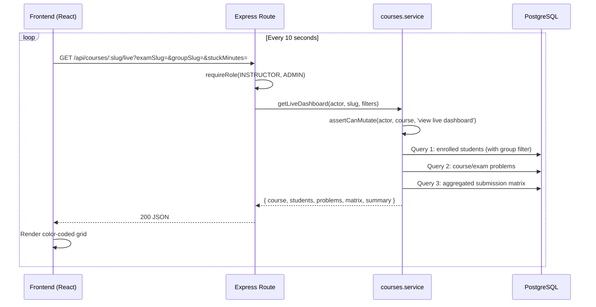

# Design Document: Live Instructor Dashboard

## Overview

The Live Instructor Dashboard is a read-only feature that provides instructors with a real-time view of student progress during lectures and exams. It consists of:

1. A backend service function + route (`GET /api/courses/:slug/live`) that computes a student × problem progress matrix from existing submission data using aggregated SQL queries.
2. A frontend page (`/teach/courses/:slug/live`) that renders the matrix as a color-coded grid with 10-second polling.

The feature introduces no new database tables — it is a pure read model over `submissions`, `group_members`, `course_problems`, and `exam_problems`, following the same pattern as the existing gradebook (ADR 0010).

### Design Decisions

| Decision | Rationale |
|---|---|
| Lives in `courses` module | Same pattern as gradebook — a read model over course data, not a new domain entity |
| Single aggregated SQL query for the matrix | Avoids N+1; efficient for 100×10 scale |
| Polling (not WebSocket) | Simpler infrastructure for pilot; WebSocket is a documented follow-up |
| `stuckMinutes` as query param | Allows instructors to tune sensitivity per session without config changes |
| Exam filter narrows both problems AND students | When viewing an exam, only show relevant data to reduce noise |

## Architecture



### Module Placement

```
Backend/src/modules/courses/
├── queries.js      ← add 3 new read-only view queries
├── service.js      ← add getLiveDashboard()
├── routes.js       ← add GET /:slug/live
└── schemas.js      ← (no changes needed; query params validated inline)

Frontend/Frontend/app/
├── routes.ts                        ← register teach/courses/:slug/live
├── routes/teach/live-dashboard.tsx  ← new page component
└── routes/teach/course-detail.tsx   ← add "Live" link/button
```

## Components and Interfaces

### Backend

#### Route: `GET /api/courses/:slug/live`

**Middleware**: `requireRole(ROLES.INSTRUCTOR, ROLES.ADMIN)`

**Query Parameters**:
| Param | Type | Default | Description |
|---|---|---|---|
| `examSlug` | string | (none) | Filter to exam problems only |
| `groupSlug` | string | (none) | Filter to group members only |
| `stuckMinutes` | positive integer | 5 | Threshold for ATTEMPTING → STUCK transition |

**Response** (200):
```json
{
  "course": { "slug": "...", "title": "..." },
  "exam": { "slug": "...", "title": "..." } | null,
  "group": { "slug": "...", "title": "..." } | null,
  "students": [
    { "id": 1, "username": "...", "fullName": "...", "groupSlug": "..." }
  ],
  "problems": [
    { "slug": "...", "title": "...", "position": 0 }
  ],
  "matrix": {
    "<studentId>:<problemSlug>": {
      "status": "SOLVED" | "ATTEMPTING" | "STUCK" | "IDLE",
      "lastSubmitAt": "2026-05-10T12:00:00Z" | null,
      "attempts": 3
    }
  },
  "summary": {
    "totalStudents": 42,
    "solved": 15,
    "attempting": 8,
    "stuck": 5,
    "idle": 14
  }
}
```

#### Service Function: `getLiveDashboard(actor, slug, { examSlug, groupSlug, stuckMinutes })`

1. Resolve course by slug → 404 if not found.
2. `assertCanMutate(actor, course, 'view live dashboard')` → 403 if not owner/admin.
3. If `examSlug` provided, resolve exam within course → 404 if not found.
4. If `groupSlug` provided, resolve group within course → 404 if not found.
5. Execute three queries in parallel:
   - Students query (filtered by group if specified)
   - Problems query (course_problems or exam_problems depending on filter)
   - Submission matrix query (aggregated)
6. Compute cell statuses from the aggregated data.
7. Compute summary counts.
8. Return the assembled response.

#### Query: Submission Matrix (the core aggregation)

```sql
SELECT
  s.user_id,
  p.slug AS problem_slug,
  COUNT(*)::int AS attempts,
  MAX(s.created_at) AS last_submit_at,
  BOOL_OR(s.status = 'ACCEPTED') AS has_accepted
FROM submissions s
JOIN course_problems cp ON cp.problem_id = s.problem_id AND cp.course_id = $1
JOIN problems p ON p.id = s.problem_id
JOIN group_members gm ON gm.user_id = s.user_id
JOIN groups g ON g.id = gm.group_id AND g.course_id = $1
WHERE s.exam_attempt_id IS NULL  -- exclude in-exam submissions from practice view
  -- (conditional: AND s.problem_id IN (SELECT problem_id FROM exam_problems WHERE exam_id = $X))
  -- (conditional: AND g.slug = $Y)
GROUP BY s.user_id, p.slug
```

The service then applies the status derivation logic in JavaScript:
- `has_accepted = true` → `SOLVED`
- `has_accepted = false AND last_submit_at > NOW() - stuckMinutes` → `ATTEMPTING`
- `has_accepted = false AND last_submit_at <= NOW() - stuckMinutes` → `STUCK`
- No row for (student, problem) → `IDLE`

### Frontend

#### Page: `LiveDashboardPage` (`/teach/courses/:slug/live`)

**State**:
- `data: LiveDashboardResponse | null` — the API response
- `loading: boolean` — initial load indicator
- `examSlug: string | null` — from URL search params
- `groupSlug: string | null` — from URL search params
- `expandedStudent: number | null` — student ID for expanded row
- `selectedCell: { studentId, problemSlug } | null` — for cell detail view

**Behavior**:
- On mount: fetch data, start 10s polling interval
- On filter change: update URL params, reset polling, re-fetch immediately
- On unmount: clear interval, abort any in-flight fetch
- Manual refresh: re-fetch immediately, reset polling timer

#### Component Hierarchy

```
LiveDashboardPage
├── LiveHeader (course title, exam badge, summary counts)
├── LiveFilters (exam dropdown, group dropdown, refresh button)
├── LiveMatrix
│   ├── LiveMatrixHeader (problem column headers)
│   └── LiveMatrixRow[] (one per student)
│       └── LiveCell[] (color-coded status cell)
├── StudentDetailPanel (expanded submission history)
└── CellDetailPanel (submissions for specific student×problem)
```

## Data Models

### Response Types (TypeScript)

```typescript
type CellStatus = 'SOLVED' | 'ATTEMPTING' | 'STUCK' | 'IDLE';

interface LiveDashboardResponse {
  course: { slug: string; title: string };
  exam: { slug: string; title: string } | null;
  group: { slug: string; title: string } | null;
  students: LiveStudent[];
  problems: LiveProblem[];
  matrix: Record<string, LiveCell>; // key: "studentId:problemSlug"
  summary: LiveSummary;
}

interface LiveStudent {
  id: number;
  username: string;
  fullName: string | null;
  groupSlug: string;
}

interface LiveProblem {
  slug: string;
  title: string;
  position: number;
}

interface LiveCell {
  status: CellStatus;
  lastSubmitAt: string | null;
  attempts: number;
}

interface LiveSummary {
  totalStudents: number;
  solved: number;
  attempting: number;
  stuck: number;
  idle: number;
}
```

### Status Derivation Logic (pseudocode)

```
function deriveStatus(cell, stuckThreshold):
  if cell is null:
    return IDLE
  if cell.hasAccepted:
    return SOLVED
  if (now - cell.lastSubmitAt) < stuckThreshold:
    return ATTEMPTING
  return STUCK
```


## Correctness Properties

*A property is a characteristic or behavior that should hold true across all valid executions of a system — essentially, a formal statement about what the system should do. Properties serve as the bridge between human-readable specifications and machine-verifiable correctness guarantees.*

### Property 1: Status derivation is exhaustive and mutually exclusive

*For any* combination of `(hasAccepted: boolean, attempts: non-negative integer, lastSubmitAt: timestamp | null, stuckThreshold: positive integer, now: timestamp)`, the `deriveStatus` function SHALL return exactly one of `SOLVED`, `ATTEMPTING`, `STUCK`, or `IDLE`, and the result SHALL satisfy:
- If `attempts === 0` (no submissions), the result is `IDLE`.
- If `hasAccepted === true`, the result is `SOLVED` regardless of timing.
- If `hasAccepted === false` and `(now - lastSubmitAt) < stuckThreshold`, the result is `ATTEMPTING`.
- If `hasAccepted === false` and `(now - lastSubmitAt) >= stuckThreshold`, the result is `STUCK`.

**Validates: Requirements 1.5**

### Property 2: Exam filter returns only exam-scoped data

*For any* course with N problems (some attached to an exam, some not) and M enrolled students (some with exam submissions, some without), when the `examSlug` filter is applied, the returned problems list SHALL contain only problems attached to that exam, and the returned students list SHALL contain only students who have at least one submission for any of those exam problems.

**Validates: Requirements 1.2**

### Property 3: Group filter returns only group members

*For any* course with multiple groups and enrolled students distributed across those groups, when the `groupSlug` filter is applied, every student in the returned list SHALL be a member of the specified group, and no student outside that group SHALL appear.

**Validates: Requirements 1.3**

### Property 4: Student sort order is stable and correct

*For any* list of students with group assignments, the sorted output SHALL satisfy: students are ordered primarily by `groupSlug` (alphabetically), and secondarily by `fullName` or `username` (alphabetically) within each group. All students in the same group are contiguous in the output.

**Validates: Requirements 3.1**

## Error Handling

| Scenario | HTTP Status | Error Message |
|---|---|---|
| No auth token / invalid token | 401 | "Unauthorized" |
| STUDENT role | 403 | "Forbidden" |
| Non-owner INSTRUCTOR | 403 | "Only the course owner or an ADMIN can view live dashboard" |
| Course slug not found | 404 | "Course not found" |
| Exam slug not found (when filter applied) | 404 | "Exam not found in this course" |
| Group slug not found (when filter applied) | 404 | "Group not found in this course" |
| Invalid `stuckMinutes` (non-positive, non-integer) | 400 | "stuckMinutes must be a positive integer" |

The error handling follows the existing pattern in `courses.service.js` — the `assertCanMutate` helper throws `HttpError(403)`, and slug lookups throw `HttpError(404)`.

## Testing Strategy

### Unit Tests (example-based)

- **Status derivation edge cases**: boundary at exactly `stuckMinutes`, zero submissions, multiple ACCEPTED submissions.
- **Response shape**: verify the JSON structure matches the TypeScript types.
- **Filter validation**: invalid `stuckMinutes` values (0, -1, "abc", 2.5).

### Property Tests

Property-based testing is appropriate for this feature because the core logic (status derivation, filtering, sorting) is pure and varies meaningfully with input.

**Library**: [fast-check](https://github.com/dubzzz/fast-check) (already available in the Node ecosystem; aligns with the project's test runner).

**Configuration**:
- Minimum 100 iterations per property test
- Each test tagged with: `Feature: live-dashboard, Property N: <title>`

**Property test tasks**:
1. Property 1 (status derivation) — generate random `(hasAccepted, attempts, lastSubmitAt, stuckThreshold, now)` tuples and verify the rules.
2. Property 2 (exam filter) — generate random course structures with exam/non-exam problems and verify filter correctness.
3. Property 3 (group filter) — generate random group memberships and verify filter correctness.
4. Property 4 (sort order) — generate random student lists with group assignments and verify sort stability.

### Integration Tests (supertest)

- Auth gating: 401 unauth, 403 STUDENT, 403 non-owner INSTRUCTOR, 200 owner, 200 ADMIN.
- 404 on unknown course slug.
- 404 on unknown exam/group slug in filters.
- 400 on invalid `stuckMinutes`.
- Happy path: seeded course with known submissions → verify correct statuses.
- Exam filter: verify problem/student narrowing.
- Group filter: verify student narrowing.
- Performance: 100×10 dataset responds within 500ms (optional, environment-dependent).

### What is NOT property-tested

- UI rendering (color-coding, animations) — visual/component tests only.
- Polling behavior — timer-based component tests with fake timers.
- SQL query count — code review / architecture constraint.
- WebSocket absence — architectural constraint verified by code review.
