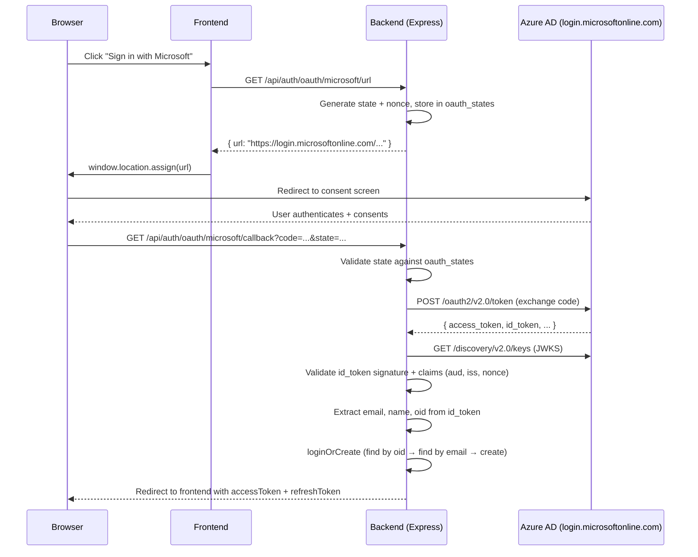

# Design Document: Microsoft 365 / Azure AD SSO

## Overview

This feature adds a Microsoft OAuth 2.0 / OpenID Connect provider to SkillForge's pluggable auth system (ADR 0005). The implementation mirrors the existing Google provider (`modules/auth/providers/google.js`) — same interface, same flow shape, different endpoints and token validation logic.

The Microsoft provider uses Azure AD's OAuth 2.0 v2.0 endpoints at `login.microsoftonline.com`. It supports both single-tenant (one university's Azure AD directory) and multi-tenant (`common` endpoint) configurations via the `MICROSOFT_TENANT_ID` environment variable.

Key design decisions:
- **Use `jose` library** for JWKS-based `id_token` validation (lightweight, zero-dependency ESM, well-maintained) rather than the heavier `openid-client` or manual JWT verification.
- **Extract claims from `id_token`** directly after signature validation — no separate Microsoft Graph `/me` call needed for basic profile (email, name, oid are standard OIDC claims).
- **Reuse `oauth_states` table** for CSRF state storage (same as Google).
- **Single migration** adds `microsoft_id TEXT UNIQUE` to the `users` table.
- **No changes** to existing auth middleware, JWT logic, or route structure — the generic `/api/auth/oauth/:provider/*` routes already exist.

## Architecture



## Components and Interfaces

### 1. Microsoft Provider Module (`modules/auth/providers/microsoft.js`)

Implements the same provider interface as `google.js`:

```javascript
export const microsoftProvider = {
  name: 'microsoft',
  type: 'oauth2',

  enabled()                          // → boolean (checks env vars)
  async buildAuthUrl({ next })       // → string (Azure AD authorize URL)
  async completeAuth({ code, state }) // → { user, frontend } | { error, frontend }
  async exchangeCode(code)           // → user
};
```

**Internal functions:**
- `loginOrCreateWithMicrosoft(idTokenPayload)` — find-by-oid → find-by-email (link) → create new user
- `exchangeCodeForTokens(code)` — POST to Azure AD token endpoint
- `validateIdToken(idToken)` — JWKS signature + claims validation via `jose`
- `getTenantId()` — returns `MICROSOFT_TENANT_ID` or `'common'`
- `buildAzureUrl(path)` — constructs `https://login.microsoftonline.com/{tenant}/{path}`

### 2. Provider Registry Update (`modules/auth/providers/index.js`)

Add `microsoftProvider` to `ALL_PROVIDERS`:

```javascript
import { microsoftProvider } from './microsoft.js';

const ALL_PROVIDERS = {
  [localProvider.name]: localProvider,
  [googleProvider.name]: googleProvider,
  [microsoftProvider.name]: microsoftProvider,
};
```

No other changes — the existing `REGISTERED` logic, `getProvider()`, `listProviders()` all work generically.

### 3. Database Migration (`db/migrations/0011_microsoft_sso.sql`)

```sql
ALTER TABLE users ADD COLUMN IF NOT EXISTS microsoft_id TEXT UNIQUE;
CREATE INDEX IF NOT EXISTS idx_users_microsoft_id ON users(microsoft_id);
```

### 4. Auth Queries Extension (`modules/auth/queries.js`)

New query functions:
- `findUserByMicrosoftId(microsoftId, executor)` — lookup by `microsoft_id`
- `insertMicrosoftUser({ username, email, microsoftId, avatarUrl, fullName, role }, executor)` — INSERT with `microsoft_id`
- `linkMicrosoftToUser(userId, { microsoftId, avatarUrl, fullName }, executor)` — UPDATE existing user

### 5. Frontend Components

**`MicrosoftButton.tsx`** — mirrors `GoogleButton.tsx`:
- Calls `GET /api/auth/oauth/microsoft/url`
- Redirects browser to the returned URL
- Uses the official Microsoft logo SVG and "Sign in with Microsoft" text
- Only rendered when the providers API reports `microsoft` as enabled

**Login/Register pages** — add `<MicrosoftButton />` below the existing `<GoogleButton />`, conditionally rendered based on provider discovery.

### 6. Nonce Storage

The `oauth_states` table already has `state` and `redirect` columns. For the Microsoft provider, we also need to store a `nonce` to validate in the returned `id_token`. Options:

- **Chosen approach**: Encode the nonce inside the `redirect` field as a JSON payload `{ redirect: "/path", nonce: "abc123" }`. This avoids a migration to add a column to `oauth_states` and keeps the change minimal. The Google provider stores a plain string in `redirect`; the Microsoft provider stores JSON. The `normalizeNext()` helper in the provider handles the difference.

Alternative considered: Add a `nonce` column to `oauth_states`. Rejected because it requires another migration for a single-use field that only Microsoft needs.

## Data Models

### Users Table (after migration 0011)

| Column | Type | Notes |
|--------|------|-------|
| microsoft_id | TEXT UNIQUE | Azure AD Object ID (`oid` claim) |

All other columns unchanged. The `microsoft_id` follows the same pattern as `google_id`.

### OAuth States Table (unchanged)

| Column | Type | Notes |
|--------|------|-------|
| state | TEXT PK | Random hex string |
| redirect | TEXT | For Microsoft: JSON `{ redirect, nonce }` |
| created_at | TIMESTAMPTZ | Auto |

### Environment Variables

| Variable | Required | Default | Description |
|----------|----------|---------|-------------|
| `MICROSOFT_CLIENT_ID` | Yes (to enable) | — | Azure AD App Registration client ID |
| `MICROSOFT_CLIENT_SECRET` | Yes (to enable) | — | Azure AD client secret |
| `MICROSOFT_TENANT_ID` | No | `'common'` | Tenant GUID or `'common'` for multi-tenant |
| `MICROSOFT_REDIRECT_URI` | No | `http://localhost:4000/api/auth/oauth/microsoft/callback` | OAuth callback URL |
| `MICROSOFT_FRONTEND_REDIRECT` | No | `http://localhost:5173/auth/callback` | Frontend redirect after auth |

## Correctness Properties

*A property is a characteristic or behavior that should hold true across all valid executions of a system — essentially, a formal statement about what the system should do. Properties serve as the bridge between human-readable specifications and machine-verifiable correctness guarantees.*

### Property 1: Authorization URL construction includes tenant and required parameters

*For any* valid `MICROSOFT_TENANT_ID` (a GUID string or `'common'`) and any valid `MICROSOFT_CLIENT_ID`, the URL returned by `buildAuthUrl()` SHALL contain the tenant in the path, and include `client_id`, `response_type=code`, `scope` containing `openid`, a cryptographic `state` parameter, and a `nonce` parameter. All Azure AD URLs (authorize, token, JWKS) constructed by the provider SHALL use the same tenant path segment.

**Validates: Requirements 2.1, 2.4, 5.1**

### Property 2: id_token validation rejects tokens with invalid signature, audience, issuer, or nonce

*For any* `id_token` where the signature does not match a key in the JWKS, OR the `aud` claim does not match the configured `MICROSOFT_CLIENT_ID`, OR the `iss` claim does not match the expected Azure AD issuer for the configured tenant, OR the `nonce` claim does not match the stored nonce, the `validateIdToken` function SHALL reject the token and throw an error.

**Validates: Requirements 6.1, 6.2, 6.3, 6.5**

### Property 3: id_token claim extraction preserves all user fields

*For any* valid `id_token` payload containing `email`, `name` (or `preferred_username`), and `oid` fields, the claim extraction function SHALL return an object containing all three values without modification.

**Validates: Requirements 5.4**

### Property 4: Invalid state rejection

*For any* random state string that does not exist in the `oauth_states` table, `completeAuth({ code, state })` SHALL return `{ error: 'invalid_state' }` without attempting token exchange.

**Validates: Requirements 5.5**

### Property 5: New user creation with derived username

*For any* valid Microsoft profile (random email, displayName, oid) where no user exists with that `oid` or `email` in the database, `loginOrCreateWithMicrosoft` SHALL create a new user whose `microsoft_id` equals the provided `oid`, whose `email` equals the provided email, and whose `username` is a valid slug derived from the email prefix or display name.

**Validates: Requirements 7.1, 7.3**

### Property 6: Existing user login by oid

*For any* existing user with a `microsoft_id` set, calling `loginOrCreateWithMicrosoft` with a profile containing that same `oid` SHALL return the existing user (same `id`) without creating a new row or modifying the existing user's email or username.

**Validates: Requirements 7.2**

### Property 7: Account linking preserves identity without duplication

*For any* existing user (created via local or Google) with email E and no `microsoft_id`, calling `loginOrCreateWithMicrosoft` with a profile containing email E SHALL: (a) return the same user `id`, (b) set `microsoft_id` on that user, (c) NOT increase the total user count, and (d) preserve the user's existing `avatar_url` and `full_name` if they were non-null.

**Validates: Requirements 8.1, 8.2, 8.3**

## Error Handling

| Scenario | Behavior |
|----------|----------|
| `buildAuthUrl()` called when provider not configured | Throw `HttpError(503)` with descriptive message |
| Missing `code` in callback | Return `{ error: 'missing_code', frontend }` |
| Invalid/expired `state` in callback | Return `{ error: 'invalid_state', frontend }` |
| Token exchange fails (network/4xx/5xx from Azure AD) | Log error, return `{ error: 'oauth_failed', frontend }` |
| `id_token` signature validation fails | Log error, return `{ error: 'oauth_failed', frontend }` |
| `id_token` claims validation fails (aud/iss/nonce) | Log error, return `{ error: 'oauth_failed', frontend }` |
| JWKS endpoint unreachable | Log error, return `{ error: 'oauth_failed', frontend }` |
| `exchangeCode()` called with empty code | Throw `HttpError(400, 'code is required')` |
| `exchangeCode()` fails during token exchange | Log error, throw `HttpError(400, 'OAuth exchange failed')` |
| Username collision during user creation | Append incrementing suffix (same as Google provider) |

All errors that reach the frontend are generic (`oauth_failed`, `invalid_state`) — no internal details leak to the client. Detailed errors are logged server-side via pino.

## Testing Strategy

### Unit Tests (example-based)

Following the existing `test/auth-providers.test.mjs` pattern:

1. **Provider shape**: `microsoftProvider` has correct `name`, `type`, methods
2. **`enabled()` logic**: returns `false` without env vars, `true` with both set
3. **`buildAuthUrl()` disabled**: throws 503 when not configured
4. **`buildAuthUrl()` enabled**: returns URL with correct domain, params, state stored in DB
5. **Registry integration**: `listProviders()` includes Microsoft with correct shape
6. **Account linking**: existing user with same email gets linked (not duplicated)
7. **First-user bootstrap**: first Microsoft user gets ADMIN role
8. **Subsequent users**: get STUDENT role

### Property-Based Tests (fast-check)

Using the existing `fast-check` devDependency:

1. **Property 1** — URL construction: generate random tenant IDs and client IDs, verify URL structure
2. **Property 2** — Token validation: generate JWTs with various invalid claims, verify rejection
3. **Property 3** — Claim extraction: generate random payloads, verify extraction
4. **Property 5** — User creation: generate random profiles, verify user creation with valid username
5. **Property 6** — Login by oid: generate random oids, verify existing user returned
6. **Property 7** — Account linking: generate random emails, verify no duplication

Each property test runs minimum 100 iterations. Tests are tagged with:
```
Feature: microsoft-sso, Property N: {property_text}
```

### Integration Tests

Extend `test/auth-providers.test.mjs` with Microsoft-specific assertions (same file, new section). Mock the Azure AD token and JWKS endpoints using `fetch` interception for the `loginOrCreate` happy path.

### What is NOT property-tested

- Frontend rendering (use component snapshot tests)
- Actual Azure AD network calls (use integration tests with mocks)
- Migration correctness (smoke test — run migration, verify column exists)
- Provider registry wiring (example-based assertions)

