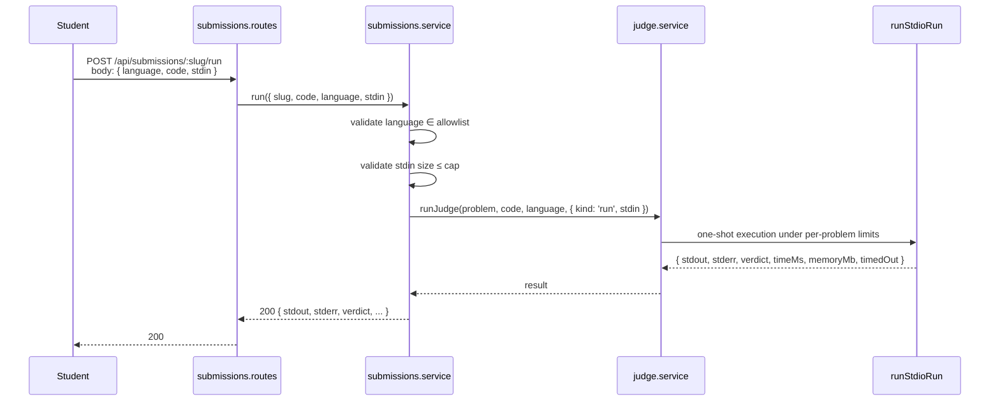
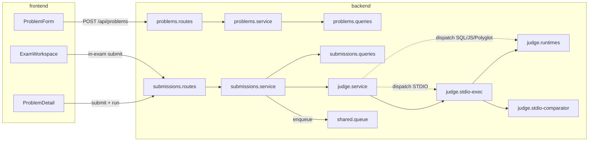

# Design Document

## Overview

SkillForge currently judges two problem shapes: function-style (JS/TS via
`isolated-vm`, Python/Java/Go via the polyglot runner from ADR 0014) and SQL
(SQLite in-memory). This spec adds a third first-class shape — **STDIO** —
where the student writes a full program that reads from standard input and
writes to standard output, and the judge compares stdout against an
instructor-authored expected output under a configurable comparator. This is
the canonical shape used by AITU's Intro / Advanced Programming courses and
by Codeforces / Kattis / ACM-ICPC.

The design is strictly additive: existing function-style and SQL judging,
their editor branches, the seed catalog, and every pre-existing test stay
untouched. New behaviour slots into the places already prepared by prior
ADRs:

| Seam | Where STDIO plugs in | ADR |
|---|---|---|
| Problem discriminator | new `problems.type = 'STDIO'` + dedicated columns | 0011 |
| Judge dispatch | new `runStdioJudge` branch inside `judge.service.runJudge(problem, code, language)` | 0004 / 0014 |
| Runtime policy | honours `JUDGE_RUNTIME_MODE=auto|local|docker|off` identically to the polyglot judge | 0014 |
| Async pipeline | reuses two-phase submit (`submit → enqueue → finalize`) + `Idempotency-Key` + polling | 0013 |
| Exam filtering | reuses `exam_attempt_id IS NULL` filter on the public recent feed | 0009 |
| Editor UI | new STDIO branch in `ProblemForm`, sibling of ALGORITHM / SQL / BACKEND / FRONTEND | 0011 |
| Module boundaries | no cross-module query imports; new STDIO code lives under `modules/judge/` and `modules/problems/` | 0003 |
| Single-tenant | no `tenant_id` on the new migration or code paths | 0001 |

Day-one supported languages: JavaScript (Node), Python 3, Java, Go, and
C++ (new `g++ -O2 -std=c++17` runtime). C++ is scoped as a new polyglot
runtime addition; if it blocks the MVP it is deferred to a follow-up spec
per Requirement 13.

### Key design decisions and rationale

1. **One migration, one new problem type, no shadow table.** Test cases
   continue to live on `problems.test_cases_json` (same column the
   function-style and SQL judges already use); only the element shape
   changes. This keeps the existing delete-usage guard, gradebook, exam
   attach/detach, audit log, and public/editor serialisation type-agnostic
   (Requirement 1.6) — no parallel code path for STDIO.
2. **Dedicated columns for limits, not JSON blobs.** `time_limit_ms`,
   `memory_limit_mb`, `output_size_cap_kb`, `comparator_mode`, and
   `language_allowlist` are stored as typed columns (Requirement 1.1) so
   range-checks, CHECK constraints, and future indexes don't require
   JSON-path extraction. Column reuse: `time_limit_ms` and
   `memory_limit_mb` already exist on the `problems` row from
   `0001_initial.sql` — we keep using them and only *add* the three
   new columns (`output_size_cap_kb`, `comparator_mode`,
   `language_allowlist`).
3. **Contest semantics for the overall verdict.** The submission-level
   verdict is the per-test verdict of the first failing test case in
   declared order; ACCEPTED only if every test passes (Requirement 7).
   This matches Codeforces / Kattis / ACM-ICPC and is what AITU
   instructors expect.
4. **Three comparator modes, no custom checker.** `EXACT`, `TRIMMED`,
   `WHITESPACE_NORMALIZED` cover ~100% of Intro / Advanced Programming
   problems without introducing SPJ surface area. `FLOAT` tolerance is
   documented as a follow-up non-goal.
5. **Reuse polyglot runtime layer, extend with C++.** `runtimes.js`
   already owns `local | docker | off | auto` selection, `--network=none`
   for Docker, minimal env, and image inspection. We add a `runStdioStep`
   helper that builds compile/run steps with stdin piping and output-cap
   capture, and a `cpp` entry to `DOCKER_IMAGES` + `localRuntime`.
6. **Zero new tables.** We add no new tables. `submissions` already
   has `exam_attempt_id` (ADR 0009), `idempotency_key`, `finished_at`
   (ADR 0013), and a nullable `output` / `error` pair — we store STDIO
   per-test results inside `output` as a JSON blob (same approach the
   function-style judge already uses for failure diffs) under a new
   serialiser, and we do not add columns to `submissions`.
7. **Hidden-test safety is enforced at serialisation, not at query.**
   The editor-detail path (`GET /api/problems/:slug/edit`) returns every
   test case; the public path (`GET /api/problems/:slug`) and the
   per-submission polling path strip HIDDEN tests' `stdin` /
   `expected_stdout` / Actual Output. One serialiser per audience,
   centralised in `problems/service.js`, so a future route cannot
   accidentally leak (Requirement 3.6, Requirement 5.6).
8. **Run flow mirrors SQL Run flow — no new route shape.** STDIO Run
   piggybacks on `POST /api/submissions/:slug/run` by accepting an
   optional `stdin` field in the request body. No persistence, same
   403 / 413 / 400 gates. The existing `SubmitSchema` is extended, not
   forked (Requirement 4).
9. **Seed-stdio tests run in the default CI runtime mix.** We do NOT
   mandate Docker-mode for `test/seed-stdio.test.mjs` — it runs under
   whatever `JUDGE_RUNTIME_MODE` the CI has set up (today `auto`),
   matching how `test/judge-polyglot.test.mjs` already works.

### Research notes

- **`isolated-vm` cannot read stdin.** `isolated-vm` has no notion of a
  stdin stream — it only takes args. STDIO on JavaScript therefore runs
  the user code as a Node subprocess (`node -e 'user code'` with stdin
  piped, not via the `isolated-vm` context). The `isolated-vm` isolate
  stays exclusively for the function-style JS/TS judge, unchanged
  (Requirement 12.4). This is the same split Codeforces / HackerRank use:
  one engine for function tests, another for stdio tests.
- **Memory limit is best-effort in `local` mode.** Node's `spawn()` does
  not expose cgroups. We monitor `process.resourceUsage().maxRSS` via a
  poller at a fixed cadence (e.g. 20 ms) and SIGKILL when peak RSS
  exceeds `memory_limit_mb`. In `docker` mode we hand memory enforcement
  to the kernel via `--memory=<MB>m`, matching the polyglot function
  judge. This dual-mode approach is documented by the Isolate sandbox
  project ([isolate sandbox](https://github.com/ioi/isolate) — used by
  IOI / Codeforces) as the industry-standard compromise between "no
  Docker dependency locally" and "hard limits in prod".
- **Output cap must be enforced inside the read loop.** If we wait for
  the subprocess to exit, a `while(true) print("x")` loop would spam
  gigabytes before the cap triggered. We consume stdout with a byte
  counter and SIGKILL the process the moment the counter exceeds
  `output_size_cap_kb * 1024`. This is the pattern used by the DMOJ
  judge ([dmoj/judge-server](https://github.com/DMOJ/judge-server/blob/master/dmoj/executors/base_executor.py))
  and by Codeforces (documented in [Codeforces blog — "How is Codeforces'
  judge implemented"](https://codeforces.com/blog/entry/79)).
- **`1.5 × T` wall-clock kill window.** This matches the convention used
  by Kattis ([Kattis problem format spec](https://www.kattis.com/problem-package-format/spec/problem_package_format#grading))
  — TLE verdict is emitted at `T`, but the process isn't actually
  guaranteed killed until `1.5 × T` has elapsed. The requirement text
  (Requirement 6.2) codifies that.
- **`g++ -O2 -std=c++17 -pipe` is the Codeforces default** (see
  [Codeforces compiler list](https://codeforces.com/blog/entry/79256)),
  which is where AITU's Intro course maps its expectations to. We reuse
  it verbatim for `local` and `docker` modes.

## Architecture

The STDIO judge is a new branch inside the existing modular monolith. No
new module is created; the work lives in `modules/judge/`, `modules/problems/`,
`modules/submissions/`, plus a migration and a new ProblemForm branch on
the frontend.

### Top-level flow (Submit)

```mermaid
sequenceDiagram
    autonumber
    participant Student
    participant Routes as submissions.routes
    participant SubSvc as submissions.service
    participant Q as shared/queue
    participant Worker as worker (inline or BullMQ)
    participant JudgeSvc as judge.service
    participant Stdio as runStdioJudge
    participant Runtime as judge/runtimes + stdio-exec

    Student->>Routes: POST /api/submissions/:slug<br/>body: { language, code }<br/>header: Idempotency-Key
    Routes->>SubSvc: submit({ user, slug, code, language, idempotencyKey })
    SubSvc->>SubSvc: validate language ∈ problem.language_allowlist
    SubSvc->>SubSvc: insertPending + enqueue
    SubSvc-->>Routes: 202 { id, status: 'PENDING', ... }
    Routes-->>Student: 202

    Q->>Worker: judge job { submissionId }
    Worker->>SubSvc: finalize(submissionId)
    SubSvc->>JudgeSvc: runJudge(problem, code, language)
    JudgeSvc->>Stdio: dispatch on problem.type === 'STDIO'
    loop for each test case in declared order
      Stdio->>Runtime: compile (if needed)
      Runtime-->>Stdio: ok | compile_error
      Stdio->>Runtime: run with stdin, wall-clock = T, RSS cap = M, output cap = K
      Runtime-->>Stdio: { stdout, stderr, timeMs, memoryMb, exit, killedReason }
      Stdio->>Stdio: compare(mode, stdout, expected_stdout)
      Stdio->>Stdio: per-test verdict
      alt first non-ACCEPTED
        Note over Stdio: stop; overall = this verdict
      end
    end
    Stdio-->>JudgeSvc: { status, per_test_results, ... }
    JudgeSvc-->>SubSvc: result
    SubSvc->>SubSvc: updateWithResult + recordSubmission + maybe bumpRating
```

### Top-level flow (Run)



The Run flow does **not** persist a submission row (Requirement 4.3), does
**not** enqueue a judge job, and does **not** touch `problems` counters or
`users.rating`. It is a synchronous entry point for "try your code against
a custom stdin".

### Module-boundary diagram



Respects ADR 0003: routes → service → queries one-way within the module;
cross-module access always goes through the other module's service; no
module's `queries.js` is imported anywhere else.

### New / changed files

| File | Purpose | New or changed |
|---|---|---|
| `db/migrations/0008_stdio_problems.sql` | widen `problems.type` CHECK + add STDIO columns | **new** |
| `Backend/src/modules/judge/service.js` | dispatch `STDIO` → `runStdioJudge` | changed |
| `Backend/src/modules/judge/stdio-exec.js` | new file: per-test subprocess exec w/ limits | **new** |
| `Backend/src/modules/judge/stdio-comparator.js` | new file: pure `compare(mode, actual, expected)` | **new** |
| `Backend/src/modules/judge/stdio-prepare.js` | new file: per-language source + compile/run args (inc. C++) | **new** |
| `Backend/src/modules/judge/runtimes.js` | add `cpp` entry + shared stdio step helpers | changed |
| `Backend/src/modules/problems/schemas.js` | add STDIO branch to zod schemas | changed |
| `Backend/src/modules/problems/service.js` | default limits, comparator mode, allowlist, public/editor split, type-change guard | changed |
| `Backend/src/modules/problems/queries.js` | read / write new columns; `test_cases_json` serialisation unchanged | changed |
| `Backend/src/modules/submissions/schemas.js` | optional `stdin` on run schema | changed |
| `Backend/src/modules/submissions/routes.js` | wire `stdin` + `LANGUAGE_NOT_ALLOWED` | changed |
| `Backend/src/modules/submissions/service.js` | language-allowlist gate; `per_test_results` passthrough | changed |
| `Backend/src/modules/submissions/queries.js` | no schema change; reuse `output` / `error` | unchanged |
| `Backend/src/shared/seed/stdio.js` | new Intro + Advanced STDIO seed problems | **new** |
| `Backend/src/shared/seed/index.js` | wire stdio seed into `runSeed()` | changed |
| `Backend/test/judge-stdio-properties.test.mjs` | fast-check properties | **new** |
| `Backend/test/stdio-comparator.test.mjs` | fast-check comparator properties | **new** |
| `Backend/test/seed-stdio.test.mjs` | reference-solution round-trip | **new** |
| `Frontend/Frontend/app/components/teach/ProblemForm.tsx` | new STDIO branch | changed |
| `Frontend/Frontend/app/lib/teaching-types.ts` | `STDIO` in `ProblemType`; new editor fields | changed |
| `Frontend/Frontend/app/routes/problem-detail.tsx` | stdin / stdout Run panels + per-test results | changed |
| `Frontend/Frontend/app/routes/exam.tsx` | same STDIO workspace | changed |

## Components and Interfaces

### Problems module (service)

```js
// modules/problems/service.js — new helpers (sketch)

export async function createProblem(payload) {
  // zod schema now accepts problemType === 'STDIO' with:
  //   testCases: [{ stdin, expected_stdout, visibility: 'SAMPLE'|'HIDDEN' }]
  //   comparatorMode: 'EXACT' | 'TRIMMED' | 'WHITESPACE_NORMALIZED'
  //   languageAllowlist: non-empty subset of { JAVASCRIPT, PYTHON, JAVA, GO, CPP }
  //   timeLimitMs default 2000, memoryLimitMb default 256, outputSizeCapKb default 64
  //   comparatorMode default 'TRIMMED'
  // Service asserts at least one SAMPLE case, ranges in [100,10000] / [16,512] / [1,1024].
}

export async function updateProblem(actor, slug, fields) {
  // REJECT type changes across the STDIO boundary with HTTP 400
  // error code TYPE_CHANGE_NOT_ALLOWED.
}

// toPublicProblemDetail strips HIDDEN test-case contents.
// toEditorProblemDetail returns every test case unredacted.
```

### Submissions module (service + routes)

```js
// modules/submissions/service.js (changes)
export async function submit({ user, slug, code, language, examAttemptId, idempotencyKey }) {
  const problem = await problems.getProblemBySlug(slug);
  if (problem?.problem_type === 'STDIO') assertLanguageAllowed(problem, language);
  // ... rest unchanged (insertPending + enqueue)
}

export async function run({ slug, code, language, stdin }) {
  const problem = await problems.getProblemBySlug(slug);
  if (problem?.problem_type === 'STDIO') {
    assertLanguageAllowed(problem, language);
    assertStdinSize(problem, stdin);                // 413 on oversize
    return runJudge(problem, code, language, { kind: 'run', stdin });
  }
  // function-style / SQL: ignore stdin, behave as today.
  return runJudge(problem, code, language);
}

function assertLanguageAllowed(problem, language) {
  const canonical = canonicalLanguage(language);
  if (!problem.language_allowlist.includes(canonical)) {
    throw new HttpError(400, 'LANGUAGE_NOT_ALLOWED', `Language "${language}" is not allowed for this problem`);
  }
}
```

### Judge module (service dispatch)

```js
// modules/judge/service.js (sketch of added branch)
import { runStdioJudge, runStdioOnce } from './stdio-exec.js';

export function runJudge(problem, code, language, options) {
  const type = (problem.problem_type || 'ALGORITHM').toUpperCase();
  if (type === 'STDIO') {
    return options?.kind === 'run'
      ? runStdioOnce(problem, code, language, options.stdin)
      : runStdioJudge(problem, code, language);
  }
  // ... existing SQL / JS / polyglot branches unchanged
}
```

### STDIO exec layer

```js
// modules/judge/stdio-exec.js (new — shape only)

export async function runStdioJudge(problem, code, language) {
  // Preconditions: problem.problem_type === 'STDIO'.
  // Returns shape aligned with existing verdict contract + stdio extension:
  //   {
  //     status: 'ACCEPTED' | 'WRONG_ANSWER' | 'TLE' | 'MLE' | 'RE'
  //           | 'COMPILE_ERROR' | 'OLE' | 'JUDGE_ERROR',
  //     runtimeMs, memoryKb, testsPassed, testsTotal,
  //     output,                  // JSON.stringify({ perTestResults }) — consumed by UI
  //     error,                   // compiler diagnostic or runtime stderr, bounded 8 KB
  //     beats,
  //   }
  const perTestResults = [];
  const compiled = await prepare(language, problem, code);   // stdio-prepare.js
  if (compiled.status === 'COMPILE_ERROR') return compileErrorVerdict(compiled);

  for (let i = 0; i < problem.test_cases.length; i++) {
    const tc = problem.test_cases[i];
    const exec = await execOneTest({
      runStep: compiled.run,
      stdin: tc.stdin,
      timeLimitMs: problem.time_limit_ms,
      memoryLimitMb: problem.memory_limit_mb,
      outputSizeCapKb: problem.output_size_cap_kb,
    });
    const perTest = classify({ exec, tc, comparatorMode: problem.comparator_mode, index: i });
    perTestResults.push(perTest);
    if (perTest.verdict !== 'ACCEPTED') break;                // contest semantics
  }
  return aggregate(perTestResults, problem);
}

export async function runStdioOnce(problem, code, language, stdin) {
  // Used by the Run flow. Executes once against the supplied stdin, returns
  // { stdout, stderr, verdict, timeMs, memoryMb, timedOut }. No persistence.
}
```

`execOneTest` contract:

| Input | Type | Notes |
|---|---|---|
| `runStep.command`, `runStep.args` | string[] | built by `stdio-prepare` (per language + per mode) |
| `runStep.workdir` | string | temp dir; cleaned up by caller |
| `stdin` | string | piped to the child's stdin; EOF after write |
| `timeLimitMs` | number | wall-clock; SIGKILL at `1.5 × T` |
| `memoryLimitMb` | number | peak-RSS cap; SIGKILL at `1.5 × M` in `local`, `--memory` in `docker` |
| `outputSizeCapKb` | number | stop capturing + SIGKILL when stdout bytes exceed the cap |

| Output | Type |
|---|---|
| `stdout` | string (bounded by cap) |
| `stderr` | string (bounded by 4 KB tail) |
| `timeMs` | number |
| `memoryMb` | number |
| `exit` | number |
| `signal` | string \| null |
| `killedReason` | `'TLE' \| 'MLE' \| 'OLE' \| null` |

### STDIO comparator (pure function)

```js
// modules/judge/stdio-comparator.js (new)

/**
 * Pure comparison used by the STDIO judge. Has no process / file / clock
 * dependency and is exported for direct property testing in
 * `test/stdio-comparator.test.mjs`.
 */
export function compareStdio(mode, actual, expected) {
  switch (mode) {
    case 'EXACT': return actual === expected;
    case 'TRIMMED': return stripOneTrailingNewline(actual) === stripOneTrailingNewline(expected);
    case 'WHITESPACE_NORMALIZED': return normalizeWs(actual) === normalizeWs(expected);
    default: throw new Error(`Unknown comparator mode: ${mode}`);
  }
}

function stripOneTrailingNewline(s) {
  if (s.endsWith('\r\n')) return s.slice(0, -2);
  if (s.endsWith('\n')) return s.slice(0, -1);
  return s;
}
function normalizeWs(s) {
  return s.replace(/[\s]+/g, ' ').replace(/^\s+|\s+$/g, '');
}
```

### STDIO prepare (per-language source + compile/run)

```js
// modules/judge/stdio-prepare.js (new — sketch)

export async function prepare(language, problem, code) {
  switch (canonicalLanguage(language)) {
    case 'JAVASCRIPT': return prepareNode(code);      // node prog.js
    case 'PYTHON':     return preparePython(code);    // python3 prog.py
    case 'JAVA':       return prepareJava(code);      // javac + java Main
    case 'GO':         return prepareGo(code);        // go build prog
    case 'CPP':        return prepareCpp(code);       // g++ -O2 -std=c++17 -pipe -o prog
    default: throw new Error(`Unsupported stdio language: ${language}`);
  }
}
```

`prepareCpp` produces:

| Mode | Compile | Run |
|---|---|---|
| `local` | `g++ -O2 -std=c++17 -pipe -o prog prog.cpp` | `./prog` (cwd = tempdir) |
| `docker` | `g++ -O2 -std=c++17 -pipe -o /workspace/prog /workspace/prog.cpp` inside `JUDGE_CPP_IMAGE` (default `gcc:13-bookworm`) with `--network=none` + `--read-only` + `--tmpfs=/tmp` | `/workspace/prog` in the same image |

C++ runtime availability probing follows the existing polyglot pattern:
`resolveRuntime('cpp')` checks local `g++ --version` first (or `docker
image inspect` for the configured image under `JUDGE_RUNTIME_MODE=docker`),
returns null when neither is available, and `runStdioJudge` emits an
overall `JUDGE_ERROR` with the reason "C++ runtime is not installed"
(Requirement 13.3).

### Frontend — ProblemForm (STDIO branch)

```tsx
// Frontend/Frontend/app/components/teach/ProblemForm.tsx (new branch)
{form.problemType === "STDIO" && (
  <StdioPanel
    testCases={form.stdioTestCases}
    onChange={(next) => patch("stdioTestCases", next)}
    timeLimitMs={form.timeLimitMs}
    memoryLimitMb={form.memoryLimitMb}
    outputSizeCapKb={form.outputSizeCapKb}
    comparatorMode={form.comparatorMode}
    languageAllowlist={form.languageAllowlist}
  />
)}
```

`StdioPanel` layout:
- Repeating rows, each a card with: `stdin` textarea, `expected_stdout`
  textarea, `visibility` segmented toggle (`SAMPLE` / `HIDDEN`), plus
  reorder + delete icons.
- Limits row: three numeric inputs (`timeLimitMs`, `memoryLimitMb`,
  `outputSizeCapKb`) with min/max inline validation mirroring the server.
- Comparator mode: single-select with three radio options.
- Language allowlist: checkbox grid for `JAVASCRIPT`, `PYTHON`, `JAVA`,
  `GO`, `CPP`.
- Client-side guardrails (Requirement 3.4): at least one test case,
  at least one SAMPLE, comparator chosen, allowlist non-empty.

### Frontend — Problem detail + exam workspace

Student view:
- Full-program Monaco editor (already present for function-style).
- Below the editor, two panels (`stdin`, `stdout`) analogous to the SQL
  Run flow; `stdout` is read-only and populated by the Run endpoint.
- Results panel renders each per-test result in declared order. For
  `SAMPLE` failures, show Actual Output + a simple line-diff against
  Expected Stdout. For `HIDDEN` cases, show verdict + resource metrics
  only (Requirement 5.6).

## Data Models

### Database schema (new migration)

```sql
-- db/migrations/0008_stdio_problems.sql

BEGIN;

-- 1) Extend the closed set of problem types to include STDIO. The column
--    currently has no CHECK (it relies on application-layer enum). We
--    add a CHECK constraint here for the same defence-in-depth the
--    roles / audit tables got in earlier migrations.
ALTER TABLE problems
  ADD CONSTRAINT problems_type_check
  CHECK (problem_type IN ('ALGORITHM', 'SQL', 'BACKEND', 'FRONTEND', 'STDIO'));

-- 2) STDIO-specific columns. All nullable so non-STDIO rows are
--    unaffected (Requirement 1.5).
ALTER TABLE problems
  ADD COLUMN IF NOT EXISTS output_size_cap_kb  INTEGER,
  ADD COLUMN IF NOT EXISTS comparator_mode     TEXT,
  ADD COLUMN IF NOT EXISTS language_allowlist  TEXT[];

-- 3) Value-range guards for the STDIO columns when present.
ALTER TABLE problems
  ADD CONSTRAINT problems_stdio_time_range
    CHECK (problem_type <> 'STDIO' OR (time_limit_ms BETWEEN 100 AND 10000)),
  ADD CONSTRAINT problems_stdio_memory_range
    CHECK (problem_type <> 'STDIO' OR (memory_limit_mb BETWEEN 16 AND 512)),
  ADD CONSTRAINT problems_stdio_output_range
    CHECK (problem_type <> 'STDIO' OR (output_size_cap_kb BETWEEN 1 AND 1024)),
  ADD CONSTRAINT problems_stdio_comparator
    CHECK (problem_type <> 'STDIO' OR (comparator_mode IN ('EXACT', 'TRIMMED', 'WHITESPACE_NORMALIZED'))),
  ADD CONSTRAINT problems_stdio_allowlist
    CHECK (problem_type <> 'STDIO' OR (array_length(language_allowlist, 1) >= 1));

COMMIT;
```

No index additions: STDIO problems are queried by `slug` (already indexed
as UNIQUE) and by `category_id` / `problem_type` (already indexed).

### `test_cases_json` element shape for STDIO

```ts
type StdioTestCase = {
  stdin: string;                               // piped to program stdin
  expected_stdout: string;                     // compared under comparator_mode
  visibility: 'SAMPLE' | 'HIDDEN';             // SAMPLE visible to students
  name?: string;                               // optional label
};
```

Stored verbatim in `problems.test_cases_json` as a JSON array. Order is
significant (contest semantics — Requirement 7.3).

### Public vs editor problem payloads

```ts
// Editor payload (GET /api/problems/:slug/edit — INSTRUCTOR / ADMIN)
type StdioEditorProblem = ProblemBase & {
  problemType: 'STDIO';
  testCases: StdioTestCase[];                  // every case, unredacted
  timeLimitMs: number;                         // 100..10000
  memoryLimitMb: number;                       // 16..512
  outputSizeCapKb: number;                     // 1..1024
  comparatorMode: 'EXACT' | 'TRIMMED' | 'WHITESPACE_NORMALIZED';
  languageAllowlist: Array<'JAVASCRIPT' | 'PYTHON' | 'JAVA' | 'GO' | 'CPP'>;
};

// Public payload (GET /api/problems/:slug — any authenticated user)
type StdioPublicProblem = ProblemBase & {
  problemType: 'STDIO';
  sampleTestCases: Array<{ stdin: string; expected_stdout: string; name?: string }>;
  timeLimitMs: number;
  memoryLimitMb: number;
  outputSizeCapKb: number;
  comparatorMode: 'EXACT' | 'TRIMMED' | 'WHITESPACE_NORMALIZED';
  languageAllowlist: Array<'JAVASCRIPT' | 'PYTHON' | 'JAVA' | 'GO' | 'CPP'>;
  // HIDDEN test cases and their stdin / expected_stdout are NEVER included
  // in this shape (Requirement 3.6).
};
```

### Submission response payload (polling / finalize)

```ts
type StdioSubmission = {
  id: number;
  status: 'PENDING' | 'ACCEPTED' | 'WRONG_ANSWER' | 'TLE' | 'MLE' | 'RE'
        | 'OLE' | 'COMPILE_ERROR' | 'JUDGE_ERROR';
  language: string;
  runtimeMs: number | null;
  memoryKb: number | null;
  perTestResults: StdioPerTestResult[] | null;      // null while PENDING
  error: string | null;                              // compiler diag (bounded 8 KB) or judge error
  createdAt: string;
  finishedAt: string | null;
  problem: { slug: string; title: string; difficulty: string };
};

type StdioPerTestResult = {
  index: number;
  verdict: 'ACCEPTED' | 'WRONG_ANSWER' | 'TLE' | 'MLE' | 'RE' | 'OLE' | 'COMPILE_ERROR' | 'JUDGE_ERROR';
  time_ms: number;
  memory_mb: number;
  stdout_bytes: number;
  visibility: 'SAMPLE' | 'HIDDEN';
  stderr_tail: string;                               // bounded 4 KB
  // Only present when verdict === 'WRONG_ANSWER' AND visibility === 'SAMPLE':
  actual_output?: string;                            // bounded to output_size_cap_kb
  // NEVER present when visibility === 'HIDDEN':
  //   stdin, expected_stdout, actual_output
};
```

The wire-format is produced by `submissions/service.js#submissionToJson`
extended with an stdio-aware branch that unwraps `output` from the row
when `problem.problem_type === 'STDIO'`. No schema change to `submissions`.

### Run response payload

```ts
type StdioRunResponse = {
  stdout: string;                                    // bounded by outputSizeCapKb
  stderr: string;                                    // bounded 4 KB
  verdict: 'ACCEPTED' | 'WRONG_ANSWER' | 'TLE' | 'MLE' | 'RE' | 'OLE' | 'COMPILE_ERROR' | 'JUDGE_ERROR';
  timeMs: number;
  memoryMb: number;
  timedOut: boolean;
};
```

### Verdict-code mapping

| Requirement name | Stored `submissions.status` | Per-test `verdict` | Rationale |
|---|---|---|---|
| ACCEPTED | `ACCEPTED` | `ACCEPTED` | matches current convention |
| WRONG_ANSWER | `WRONG_ANSWER` | `WRONG_ANSWER` | matches current convention |
| TIME_LIMIT_EXCEEDED | `TLE` | `TLE` | `submissions.status` already has `TLE` |
| MEMORY_LIMIT_EXCEEDED | `MLE` | `MLE` | new value in per-test; overall uses `MLE` |
| RUNTIME_ERROR | `RE` | `RE` | new short form; aligns with Codeforces |
| COMPILE_ERROR | `COMPILE_ERROR` | `COMPILE_ERROR` | matches current convention (whole submission) |
| OUTPUT_LIMIT_EXCEEDED | `OLE` | `OLE` | new value |
| JUDGE_ERROR | `JUDGE_ERROR` | `JUDGE_ERROR` | already added by ADR 0013 |

The application-level status CHECK/enum in `submissions/queries.js` is
kept in sync; no DB migration is required for these values because the
existing column has no CHECK constraint (see `0001_initial.sql`).


## Correctness Properties

*A property is a characteristic or behavior that should hold true across all
valid executions of a system — essentially, a formal statement about what
the system should do. Properties serve as the bridge between human-readable
specifications and machine-verifiable correctness guarantees.*

The STDIO judge is dominated by pure transformations (comparator,
aggregator, classifier, serialiser) and well-defined state transitions
(submit → enqueue → finalize), which makes property-based testing a
strong fit. Properties are listed in the order the implementation should
introduce them; each one references the requirements it validates
(Requirement numbers refer to `.kiro/specs/stdio-judge/requirements.md`).

### Property 1: Valid STDIO problem creation is round-trip preserving

*For any* valid STDIO problem payload (non-empty `testCases` with at least
one `SAMPLE`, `comparatorMode` in the allowed set, `languageAllowlist` a
non-empty subset of `{ JAVASCRIPT, PYTHON, JAVA, GO, CPP }`, and limits
within the documented ranges), creating the problem via `POST /api/problems`
SHALL return HTTP 201 and a subsequent `GET /api/problems/:slug/edit` SHALL
return an editor payload equal to the created payload up to server-applied
defaults.

**Validates: Requirements 3.3, 3.5**

### Property 2: Hidden test-case contents never escape to public surfaces

*For any* STDIO problem with mixed `SAMPLE` / `HIDDEN` test cases and any
submission finalized against it, the public shapes — `GET /api/problems/:slug`
body and `GET /api/submissions/:id` body — SHALL NOT contain any `HIDDEN`
test case's `stdin`, `expected_stdout`, or Actual Output anywhere in their
serialised JSON.

**Validates: Requirements 3.6, 5.6**

### Property 3: STDIO field validation is a range / enum / non-empty check

*For any* STDIO problem create payload, acceptance SHALL equal the
conjunction of:
- `timeLimitMs ∈ [100, 10000]`;
- `memoryLimitMb ∈ [16, 512]`;
- `outputSizeCapKb ∈ [1, 1024]`;
- `comparatorMode ∈ { EXACT, TRIMMED, WHITESPACE_NORMALIZED }`;
- `languageAllowlist ⊆ { JAVASCRIPT, PYTHON, JAVA, GO, CPP }` and non-empty;
- `testCases` is a non-empty array of `{ stdin, expected_stdout, visibility }`
  objects with at least one `visibility === 'SAMPLE'`.

**Validates: Requirements 1.3, 1.4, 2.4, 2.5, 2.6**

### Property 4: Language-not-allowed is rejected on every submission entry point

*For any* STDIO problem and any language string not in the problem's
`languageAllowlist`, both `POST /api/submissions/:slug` (Submit flow) and
`POST /api/submissions/:slug/run` (Run flow) SHALL respond HTTP 400 with
error code `LANGUAGE_NOT_ALLOWED`, and the Submit path SHALL NOT insert a
row into `submissions`.

**Validates: Requirements 4.6, 5.2**

### Property 5: Stdin size exceeding the cap is rejected before execution

*For any* STDIO problem and any Run-flow request whose `stdin` body
length in bytes exceeds the per-problem cap (or 1 MB, whichever is
smaller), the request SHALL be rejected with HTTP 413 before any
subprocess, container, or judge is invoked.

**Validates: Requirement 4.5**

### Property 6: Per-test verdict classifier respects limits and comparator

*For any* test-case execution record `exec = { exit, signal, killedReason,
stdout, stderr, timeMs, memoryMb, stdoutBytes }` and any configured
`comparatorMode`, the classifier function `classify(exec, expectedStdout,
comparatorMode, limits)` SHALL return:
- `OLE` if `killedReason === 'OLE'` or `stdoutBytes > output_size_cap_kb * 1024`;
- `TLE` if `killedReason === 'TLE'` or `timeMs > time_limit_ms`;
- `MLE` if `killedReason === 'MLE'` or `memoryMb > memory_limit_mb`;
- `RE` if `exit !== 0` or (`signal !== null` and `signal !== 'SIGKILL'` for
  a judge-issued kill);
- `WRONG_ANSWER` if none of the above and `compareStdio(comparatorMode,
  stdout, expectedStdout) === false`;
- `ACCEPTED` otherwise.

**Validates: Requirements 6.1, 6.2, 6.3, 6.4, 6.6, 6.7, 8.4**

### Property 7: Compile errors short-circuit and bound the diagnostic

*For any* STDIO problem, any compiled language in `{ JAVA, GO, CPP }`, and
any student source that fails to compile, the overall verdict SHALL be
`COMPILE_ERROR`, the persisted `perTestResults` array SHALL be empty,
no per-test subprocess SHALL be launched, and the stored compiler
diagnostic SHALL be at most 8 KB in length.

**Validates: Requirement 6.5**

### Property 8: Comparator mode branches behave as specified

*For any* strings `actual` and `expected`:
- `compareStdio('EXACT', actual, expected) === (actual === expected)`;
- `compareStdio('TRIMMED', actual, expected) ===
  (stripOneTrailingNewline(actual) === stripOneTrailingNewline(expected))`;
- `compareStdio('WHITESPACE_NORMALIZED', actual, expected) ===
  (normalizeWs(actual) === normalizeWs(expected))`.

**Validates: Requirements 8.1, 8.2, 8.3**

### Property 9: Comparator is reflexive for every mode

*For any* string `s` and any `mode ∈ { EXACT, TRIMMED, WHITESPACE_NORMALIZED }`,
`compareStdio(mode, s, s) === true`.

**Validates: Requirement 8.5**

### Property 10: Overall verdict is the first failing per-test verdict

*For any* ordered list `R = [r_1, …, r_n]` of per-test verdicts produced by
the STDIO judge for a single submission, the stored overall verdict SHALL
equal `r_i.verdict` where `i` is the smallest index with `r_i.verdict !==
'ACCEPTED'`, or `ACCEPTED` if no such `i` exists. The iteration order SHALL
match the declared test-case order of the problem, and the per-test list
SHALL NOT be reordered, shuffled, or parallelised.

**Validates: Requirements 7.1, 7.2, 7.3**

### Property 11: runJudge dispatches by problem.type

*For all* problems `p`, invoking `runJudge(p, code, language)`:
- *For any* `p.problem_type === 'STDIO'`, invokes `runStdioJudge` exactly
  once and does NOT invoke the SQL, JS-isolated-vm, or polyglot function
  branches;
- *For any* `p.problem_type ∈ { ALGORITHM, BACKEND, FRONTEND, SQL }`,
  invokes the branch that existed on the pre-STDIO baseline, producing
  the same verdict value and per-test result list as that baseline for
  the same inputs.

**Validates: Requirements 10.1, 10.2**

### Property 12: Submission lifecycle shape is invariant across problem type

*For any* submission of *any* problem type (STDIO or function-style or SQL),
`POST /api/submissions/:slug` SHALL respond HTTP 202 with a row in status
`PENDING`, and polling `GET /api/submissions/:id` SHALL eventually return
a row whose wire shape uses the same field names and value types as a
function-style submission (`status`, `verdict`, `per_test_results` /
`perTestResults` nullable while `PENDING`).

**Validates: Requirements 5.1, 5.3, 10.3, 10.5, 10.6**

### Property 13: Unhandled judge failure leaves counters and rating unchanged

*For any* STDIO submission whose `runStdioJudge` throws during `finalize()`,
the row SHALL be transitioned to `status = 'JUDGE_ERROR'` with
`finished_at` populated, the `problems.total_submissions` /
`problems.accepted_submissions` counters SHALL be unchanged from their
pre-submission values, and the submitter's `users.rating` SHALL be
unchanged.

**Validates: Requirement 10.7**

### Property 14: In-exam submissions are excluded from the public recent feed across types

*For any* set of finalized submissions with mixed `problem_type` values
(including STDIO) and mixed `exam_attempt_id` values, the response of
`GET /api/submissions/recent` SHALL contain every submission where
`exam_attempt_id IS NULL` and NONE where `exam_attempt_id IS NOT NULL`.

**Validates: Requirement 11.2**

### Property 15: Run flow is never persisted

*For any* Run-flow request `POST /api/submissions/:slug/run` with a valid
body, the row count of the `submissions` table SHALL be identical before
and after the request, regardless of the judge verdict, regardless of
whether the program compiles, regardless of problem type.

**Validates: Requirement 4.3**

### Property 16: Problem type is immutable across the STDIO boundary

*For any* existing problem and any `PUT /api/problems/:slug` request
whose `problemType` differs from the stored value in a way that involves
crossing the STDIO boundary (STDIO ↔ non-STDIO), the service SHALL
respond HTTP 400 with error code `TYPE_CHANGE_NOT_ALLOWED` and SHALL
NOT modify the row.

**Validates: Requirement 12.1**

### Property 17: Unavailable C++ runtime yields a clear JUDGE_ERROR

*For any* STDIO problem whose `languageAllowlist` contains `CPP` and any
submission in `CPP` made while neither a local `g++` nor the configured
C++ Docker image is available, the overall verdict SHALL be `JUDGE_ERROR`
with a human-readable reason identifying the missing C++ runtime, and no
other language SHALL be attempted as a fallback.

**Validates: Requirement 13.3**

### Property 18: Container failure maps to JUDGE_ERROR for the affected test

*For any* test-case execution in `docker` mode whose container fails to
start, crashes before completing, or is terminated by the orchestrator
for reasons unrelated to the student program (non-zero Docker daemon
exit, image pull failure, OOMKilled by daemon despite in-limit RSS),
the per-test verdict for the affected test case SHALL be `JUDGE_ERROR`
and the first-failure aggregator SHALL surface `JUDGE_ERROR` as the
overall verdict if this is the first failing test.

**Validates: Requirement 9.6**

## Error Handling

STDIO-specific error cases and the HTTP / verdict codes they produce.

### Authoring (Problems service)

| Condition | HTTP | Error code / message |
|---|---|---|
| `type === 'STDIO'` missing `testCases` | 400 | `{ field: 'testCases', ... }` |
| `type === 'STDIO'` `testCases` empty | 400 | `{ field: 'testCases', message: 'at least one test case required' }` |
| `type === 'STDIO'` no SAMPLE case | 400 | `{ field: 'testCases', message: 'at least one SAMPLE test case required' }` |
| `comparatorMode` not in enum | 400 | zod validation |
| `languageAllowlist` empty or contains unknown language | 400 | zod validation |
| `timeLimitMs ∉ [100, 10000]` | 400 | zod validation |
| `memoryLimitMb ∉ [16, 512]` | 400 | zod validation |
| `outputSizeCapKb ∉ [1, 1024]` | 400 | zod validation |
| `PUT /api/problems/:slug` attempts type change across STDIO boundary | 400 | `TYPE_CHANGE_NOT_ALLOWED` |

### Submit + Run (Submissions service)

| Condition | HTTP | Error code |
|---|---|---|
| `language` ∉ `problem.language_allowlist` | 400 | `LANGUAGE_NOT_ALLOWED` |
| Run-flow `stdin` bytes > min(`outputSizeCapKb`, 1 MB) | 413 | `STDIN_TOO_LARGE` |
| `Idempotency-Key` reused by a different user | 409 | `IDEMPOTENCY_KEY_IN_USE` |
| Judge queue enqueue fails | 503 | "Judge queue is unavailable, please retry" |

### Judge (runStdioJudge + stdio-exec)

| Condition | Overall verdict | Per-test verdict | Notes |
|---|---|---|---|
| Compile step fails (CPP / JAVA / GO) | `COMPILE_ERROR` | — (no tests run) | `error` = bounded 8 KB diagnostic |
| Wall-clock > `time_limit_ms` | first-failure propagation | `TLE` | SIGKILL by `1.5 × T` |
| Peak RSS > `memory_limit_mb` | first-failure propagation | `MLE` | enforced by poller (local) or `--memory` (docker) |
| Stdout bytes > `output_size_cap_kb * 1024` | first-failure propagation | `OLE` | stop capturing + SIGKILL |
| Non-zero exit / unexpected signal | first-failure propagation | `RE` | `stderr_tail` bounded 4 KB |
| Comparator mismatch | first-failure propagation | `WRONG_ANSWER` | Actual Output included for SAMPLE only |
| Runtime mode `off` | `JUDGE_ERROR` | — | no subprocess/container invoked |
| C++ runtime unavailable | `JUDGE_ERROR` | — | reason: "C++ runtime is not installed" |
| Container fails to start / crashes | first-failure propagation | `JUDGE_ERROR` | in `docker` mode |
| Uncaught exception in judge | `JUDGE_ERROR` (`submissions.status`) | — | `finished_at` stamped; counters/rating unchanged |

### Boundaries on captured buffers

- `stdout` captured per-test: hard cap at `output_size_cap_kb * 1024` bytes.
- `stderr_tail` per-test: last 4 KB (4096 bytes) of stderr.
- `error` on submission row (compiler diagnostic): up to 8 KB (8192 bytes).
- `actual_output` exposed on SAMPLE failures: up to `output_size_cap_kb`
  bytes.

All bounds are enforced before the values leave `stdio-exec.js`, so
downstream serialisers can assume sanity.

## Testing Strategy

PBT is applicable to the pure-function and state-machine layers of the
STDIO judge and explicitly NOT applicable to the IaC / OS-level
subprocess-spawning details.

### Property-based tests (fast-check)

Library choice: **[fast-check](https://fast-check.dev/)** — MIT-licensed,
TypeScript-friendly, integrates with any node test runner. Already the
de-facto choice for the JS/Node ecosystem; no alternative is comparable
in ergonomics for this codebase.

Each property test MUST:
- Run ≥ 100 iterations (fast-check default is 100; we leave it unless a
  generator is obviously under-exploring, in which case we raise to 500);
- Carry a header comment tagged
  `// Feature: stdio-judge, Property {number}: {property_text}` that
  references the design-document property it implements;
- Use mocks for subprocess / container runtimes except where explicitly
  called out below — mocks keep 100 iterations in the ~1s range and
  decouple the property from CI runtime flakiness.

New property test files:

| File | Properties | Uses mocks? |
|---|---|---|
| `test/stdio-comparator.test.mjs` | P8, P9 | n/a (pure) |
| `test/judge-stdio-properties.test.mjs` | P6, P7, P10, P11, P13, P17, P18 | yes (mock `execOneTest`) |
| `test/integration-stdio.test.mjs` | P1, P2, P3, P4, P5, P12, P14, P15, P16 | no (supertest + real DB + inline queue) |

Each property line maps 1:1 to a `fc.assert(fc.property(...))` call. No
hand-rolled shrinkers; fast-check's built-in shrinkers are sufficient
for strings, ints, arrays, and tagged-union payloads.

### Unit and integration tests (example-based)

Example-based tests cover behaviour that doesn't benefit from input
variation:

| File | Coverage |
|---|---|
| `test/integration-stdio.test.mjs` | per-type-defaulting (2.1, 2.2, 2.3, 2.7), UI-shape smokes through the editor payload (3.1, 3.2), idempotent-replay for STDIO (5.4), type-change 12.1 (as one example alongside its property), seed-existence smoke |
| `test/judge-stdio-runtime.test.mjs` | runtime-mode branches (9.1 local, 9.2 docker, 9.3 auto, 9.4 off, 9.5 `--network=none` argv), TLE / MLE / OLE / CE with real subprocesses; kept small (≤ 10 cases), each case ≤ 2 s |
| `test/seed-stdio.test.mjs` | reference-solution × allowed-language cross product (14.3); enumerated, not randomised; same shape as `test/seed-backend.test.mjs` |

### Regression protection for existing behaviour

Property 11 (dispatch invariant) explicitly asserts that non-STDIO
types route to the same judges they used on the baseline. Alongside it:

- `test/judge.test.mjs` (14 assertions), `test/judge-isolation.test.mjs`
  (10 assertions), `test/judge-polyglot.test.mjs` (7 assertions),
  `test/seed-backend.test.mjs`, `test/seed-frontend.test.mjs`,
  `test/seed-sql.test.mjs` must all pass **unchanged**. This is tracked
  as a hard CI requirement (Requirement 12.3) and verified by the CI
  `npm test` job.

### Test configuration

- `JUDGE_QUEUE=inline` for all PBT + integration suites (matches existing
  convention for fast, deterministic submits).
- `JUDGE_RUNTIME_MODE` unset (defaults to `auto`) for seed-stdio + runtime
  suites; the CI Ubuntu runner has local `python3`, `javac`, `go`, and
  `g++` available, so local-mode tests work without Docker. On CI we
  additionally run the runtime suite with `JUDGE_RUNTIME_MODE=docker`
  only if `docker` is reachable (`docker info` probe in the CI script),
  consistent with the polyglot judge's existing behaviour.

### Observability of property failures

fast-check's `counterexample` output is sufficient. When a property
fails, the counterexample (shrunk) plus the property header comment
(pointing at the design-doc property) gives enough context to open an
issue without re-running. No additional telemetry is added.

### Hard non-goals for testing

- We do NOT property-test infrastructure: `docker run` flags, container
  startup, network isolation beyond `--network=none` argv inspection.
- We do NOT property-test memory-cap accuracy under load: memory
  enforcement in `local` mode is best-effort (see research note), and a
  randomised memory-pressure test would be flaky without cgroups. One
  deterministic MLE integration check at real-subprocess level is
  enough.
- We do NOT replay the historical `judge` / `judge-polyglot` suites as
  properties; they remain example-based and act as regression guards.
